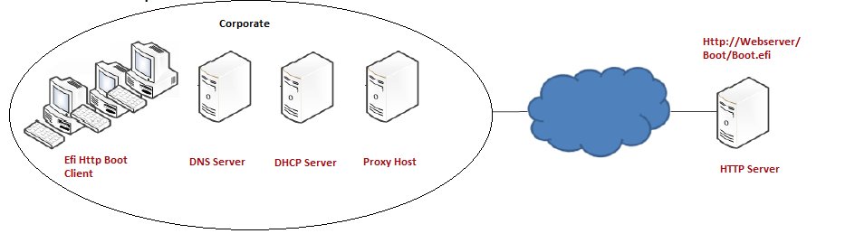
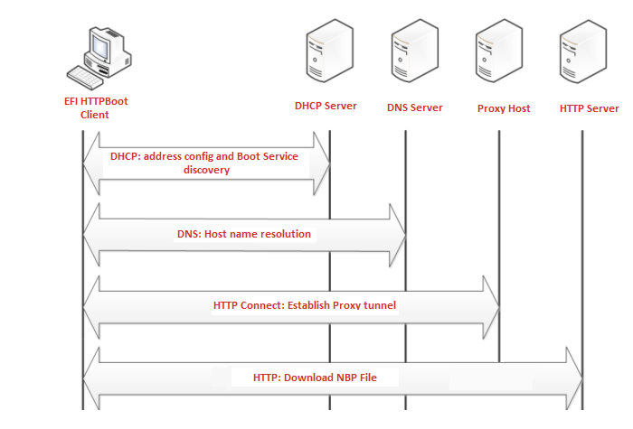

# Title: Support for Proxy Host URI in HTTP Boot

# Status: Draft

# Document: UEFI specification Version 2.10

# License

SPDX-License-Identifier: CC-BY-4.0

# Submitter: [Saloni Kasbekar](mailto:saloni.kasbekar@intel.com), [Maciej Rabeda](mailto:maciej.rabeda@intel.com)

# Summary of change

Extension of section 24.7 explaining:
- HTTP boot scenario when Proxy Host is utilized.
- Changes to HTTP boot device path (proxy URI node).

Extension of section 29.6:
- New EFI_HTTP_CONNECT_REQUEST_DATA structure to be used for HTTP CONNECT Method
- Update in Url description to include default HTTPS port.

# Benefits of the change

Proposed changes:
- introduce support for HTTP CONNECT request for proxy support.
- allow for better understanding of functionality being added to EDK2.

# Impact of the change

Additional content is added to the UEFI specification.
Numbering of sections 24.7.10-12 is shifted forward.

# Detailed description of the change

## (Extension) 24.7.2.1 Use in Corporate Environment

**Proxy Host** is optional. It is located within the corporate environment and acts as an intermediary between the Client and Endpoint Server.



Fig. 24.5: HTTP Boot Network Topology with Proxy Concept - Corporate Environment

## (Extension) 24.7.3.1 Device Path

In cases where a Proxy Host is used to connect to the Endpoint Server, the ProxyURI device path and BootURI device path are
appended to the parent device path, for example:
```
PciRoot(0x0)/Pci(0x19, 0x0)/MAC(001230F4B4FF, 0x0)/IPv4(0.0.0.0, 0, DHCP, 0.0.0.0, 0.0.0.0, 0.0.0.0)/Uri(ProxyURI)/Uri(EndpointServerURI)
PciRoot(0x0)/Pci(0x19, 0x0)/MAC(001230F4B4FF, 0x0)/IPv6(::/128, 0, Static, ::/128, ::/128, 0)/Uri(ProxyURI)/Uri(EndpointServerURI)
```

## (New chapter) 24.7.10 Concept of Message Exchange in HTTP Boot scenario (with Proxy Host)

The concept of HTTP Boot message exchange sequence with Proxy Host is as follows:
- The client establishes connection with the DHCPv4/v6 server as described in _Message exchange between EFI Client and DHCPserver using DHCP Client Extensions_, _Message exchange between UEFI Client and DHCPserver not using DHCP Client Extensions_, _Message exchange between EFI Client andDHCPv6 server with DHCP Client extensions_ and _Message exchange between UEFI Client and DHCPv6 server not using DHCP Client Extensions_.
- After several intermediate steps, besides the standard configuration such as address/subnet/router/dns-server, the client will initiate a HTTP CONNECT request to the Proxy Host to establish a TCP/IP tunnel. This allows the Proxy Host to forward the TCP connection from the client to the desired destination.
- The client sends a HTTP GET/HEAD request with the Endpoint Server's boot resource location in the format of a URI to the Proxy Host. The URI points to the NBP which is appropriate for this client hardware configuration.
- A boot option is created, and if selected by the system logic the client then uses HTTP to download the NBP from the HTTP server into memory.
- The client executes the downloaded NBP image from memory. This image can then consume other UEFI interfaces for further system setup.



Fig. 24.8: HTTP Boot Overall Flow with Proxy Host

## (Extension) 29.6.6 EFI_HTTP_PROTOCOL.Request()

**Url** The URI of a remote host. From the information in this field, the HTTP instance will be able to determine whether
to use HTTP or HTTPS and will also be able to determine the port number to use. If no port number is specified, port 80 (HTTP) or 443 (HTTPS) is assumed. See RFC 3986 for more details on URI syntax.

In cases when Method field in the Request structure is set to HttpMethodConnect, the HTTP driver expects that the supplied Request structure type is EFI_HTTP_CONNECT_REQUEST_DATA.
```
//*******************************************
// EFI_HTTP_CONNECT_REQUEST_DATA
//*******************************************
typedef struct {
  EFI_HTTP_REQUEST_DATA   Base;
  CHAR16                  *ProxyUrl;
} EFI_HTTP_CONNECT_REQUEST_DATA;
```
EFI_HTTP_CONNECT_REQUEST_DATA structure begins with base EFI_HTTP_REQUEST_DATA structure (Base) for backward compatibility. HTTP driver is expected to type-cast EFI_HTTP_MESSAGE Request field to EFI_HTTP_CONNECT_REQUEST_DATA in order to obtain additional fields required to establish a connection with a proxy server:

**ProxyUrl**  The URI of a Proxy Host, to be used only when using HttpMethodConnect in Base->Method. From the information in this field, the HTTP instance will be able to determine the port number to use and whether to use HTTP or HTTPS and will also be able to determine the port number to use. If no port number is specified, port 80 (HTTP) or 443 (HTTPS) is assumed. While ProxyUrl determines the HTTP/HTTPS protocol between the Client and Proxy Host, Base->Url determines the protocol between the Proxy Host and Endpoint Server. See RFC 3986 for more details on URI syntax.