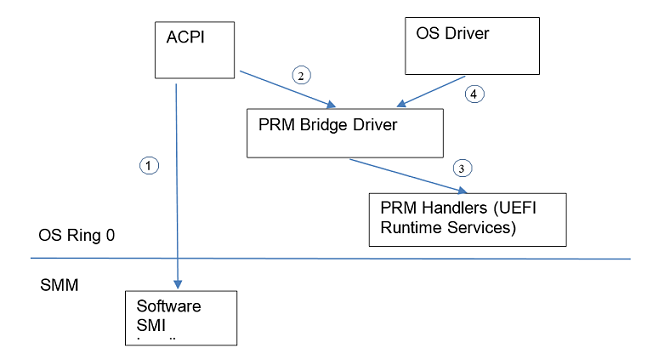
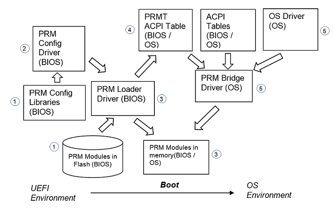
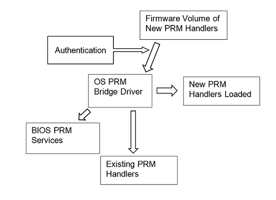
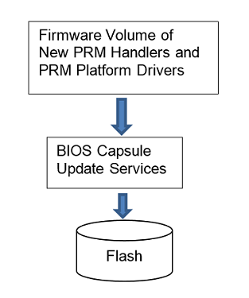

# **Platform Runtime Mechanism Handler Writer’s Guide**

### **Revision 0.7**
### **July, 2020</strong>**

## **Acknowledgements**

Redistribution and use in source (original document form) and 'compiled'
forms (converted to PDF, epub, HTML and other formats) with or without
modification, are permitted provided that the following conditions are
met:

1.  Redistributions of source code (original document form) must retain
    the above copyright notice, this list of conditions and the
    following disclaimer as the first lines of this file unmodified.

2.  Redistributions in compiled form (transformed to other DTDs,
    converted to PDF, epub, HTML and other formats) must reproduce the
    above copyright notice, this list of conditions and the following
    disclaimer in the documentation and/or other materials provided with
    the distribution.

THIS DOCUMENTATION IS PROVIDED BY TIANOCORE PROJECT "AS IS" AND ANY
EXPRESS OR IMPLIED WARRANTIES, INCLUDING, BUT NOT LIMITED TO, THE
IMPLIED WARRANTIES OF MERCHANTABILITY AND FITNESS FOR A PARTICULAR
PURPOSE ARE DISCLAIMED. IN NO EVENT SHALL TIANOCORE PROJECT BE LIABLE
FOR ANY DIRECT, INDIRECT, INCIDENTAL, SPECIAL, EXEMPLARY, OR
CONSEQUENTIAL DAMAGES (INCLUDING, BUT NOT LIMITED TO, PROCUREMENT OF
SUBSTITUTE GOODS OR SERVICES; LOSS OF USE, DATA, OR PROFITS; OR BUSINESS
INTERRUPTION) HOWEVER CAUSED AND ON ANY THEORY OF LIABILITY, WHETHER IN
CONTRACT, STRICT LIABILITY, OR TORT (INCLUDING NEGLIGENCE OR OTHERWISE)
ARISING IN ANY WAY OUT OF THE USE OF THIS DOCUMENTATION, EVEN IF ADVISED
OF THE POSSIBILITY OF SUCH DAMAGE.

Copyright (c) 2020, Intel Corporation. All rights reserved.

-------
## **Revision History**

<table>
<thead>
<tr class="header">
<th><strong>Revision</strong></th>
<th><strong>Revision History</strong></th>
<th><strong>Date</strong></th>
</tr>
</thead>
<tbody>
<tr class="odd">
<td>0.1</td>
<td>Initial Draft</td>
<td>April 2020</td>
</tr>
<tr class="even">
<td>0.7</td>
<td>
Added direct call of PRM;

Populated code definitions
</td>
<td>July 2020</td>
</tr>
</tbody>
</table>

## **Table of Contents**

[**1. Introduction**](#1-introduction)

[**2. Overall Flows**](#2-overall-flows)

[2.1 Boot and Runtime Flows](#21-boot-and-runtime-flows)

[*--- 2.1.1 Boot Flow*](#211-boot-flow)

[*--- 2.1.2 OS Runtime PRM Handling Flow*](#212-os-runtime-prm-handling-flow)

[2.2 OS Runtime PRM Update Flow](#22-os-runtime-prm-update-flow)

[**3. Libraries Used by PRM Handlers**](#3-libraries-used-by-prm-handlers)

[3.1 Base Libraries](#31-base-libraries)

[3.2 I/O Libraries](#32-io-libraries)

[*--- 3.2.1 IO Lib*](#321-io-lib)

[*--- 3.2.2 High level IO Libs (PCI Lib, etc.)*](#322-high-level-io-libs-pci-lib-etc.)

[3.3 PRM Memory Allocation Library Instance](#33-prm-memory-allocation-library-instance)

[3.4 PRM Library Initialization](#34-prm-library-initialization)

[**4. Code Definitions**](#4-code-definitions)

[4.1 PRMT ACPI Table](#41-prmt-acpi-table)

[*--- 4.1.1 PRM\_HANDLER\_INFORMATION\_STRUCT*](#411-prm_handler_information_struct)

[*--- 4.1.2 PRM\_MODULE\_INFORMATION\_STRUCT*](#412-prm_module_information_struct)

[*--- 4.1.3 PRM \_ACPI\_DESCRIPTION\_TABLE*](#413-prm-_acpi_description_table)

[4.2 Static Information Exported by PRM Module](#42-static-information-exported-by-prm-module)

[*--- 4.2.1 PRM\_HANDLER\_EXPORT\_DESCRIPTOR\_STRUCT*](#421-prm_handler_export_descriptor_struct)

[*--- 4.2.2 PRM\_MODULE\_EXPORT\_DESCRIPTOR\_STRUCT*](#422-prm_module_export_descriptor_struct)

[4.3 Dynamic Information Reported through PRM Config Protocol](#43-dynamic-information-reported-through-prm-config-protocol)

[*--- 4.3.1 PRM\_CONTEXT\_BUFFERS*](#431-prm_context_buffers)

[*--- 4.3.2 PRM\_RUNTIME\_MMIO\_RANGES*](#432-prm_runtime_mmio_ranges)

[*--- 4.3.3 PRM\_MODULE\_CONTEXT\_BUFFER*](#433-prm_module_context_buffer)

[*--- 4.3.4 PRM\_CONFIG\_PROTOCOL*](#434-prm_config_protocol)

[*--- 4.4 PRM\_HANDLER function*](#44-prm_handler-function)

[4.5 PRM Module Entry Point](#45-prm-module-entry-point)

[**5. Code Samples**](#5-code-samples)

[5.1 ASL code that invokes a PRM call through OpRegion write](#51-asl-code-that-invokes-a-prm-call-through-opregion-write)

[5.2 PRM Handler Skeleton Codes](#52-prm-handler-skeleton-codes)

[**6. Discussions**](#6-discussions)

## **Figures**

[Figure 1‑1 PRM Overall Architecture](#_Toc38205955)

[Figure 2‑1 PRM Components](#_Toc38205956)

[Figure 2‑2 PRM Update in Memory](#_Toc38205957)

[Figure 2‑3 PRM Update in Flash](#_Toc38205958)

## **Tables**

[Table 2‑1 Example map of PRM Modules and PRM Handlers](#_Toc38205966)

---------

# **1. Introduction**

Platform Runtime Mechanism (PRM) is a runtime firmware enivorenment that
addresses some existing problems of SMM:

-   SMM codes have unlimited privileges to system hardware, but run in a
    black box that cannot be audited. Viewed as a vulnerability by OS

-   SMM impacts system performance by requiring all CPUs to enter SMM
    while an SMM event happens

<strong>Figure 1‑1 PRM Overall
Architecture</strong>

1:  The traditional way: ACPI calls software SMI

2 / 3: The PRM way through ACPI call: ACPI call is captured by a PRM Bridge
Driver, and the PRM Bridge Driver calls into PRM Handlers (as UEFI
Runtime Services) on behalf of the ACPI call, and returns the result to
ACPI.

4 / 3: The PRM way through direct call by driver: instead of calling ACPI, an
OS driver can directly call PRM handler through the PRM Bridge Driver.

This document describes the implementation aspects in the PRM
infrastructure and PRM handlers. Please refer to PRM specification (\*\*
TBD: link) for a formal definition of the PRM interface between BIOS and
OS.

# **2. Overall Flows**

## **2.1 Boot and Runtime Flows**

This section describes the BIOS and OS components involved in system
boot flow to establish a PRM environment.

<strong>Figure 2‑1 PRM Components
</strong>

### **2.1.1 Boot Flow**

From BIOS to OS, following actions are taken for PRM to be ready for
use:

*1.*  A PRM Module is a PE image that provides a set of PRM Handlers. PRM
    Modules are stored as part of the system BIOS in the system flash’s
    BIOS region.

    1.  A PRM Module is agnostic of the design of hosting BIOS.

    2.  In order for a PRM Module to collect environmental info from the
        hosting BIOS at boot time, a PRM Config Library is implemented
        for the PRM Module

        1.  The PRM Config Library acts a bridge between the PRM Module
            and the hosting BIOS. The implementation of the PRM Config
            Library depends on the hosting BIOS.

    3.  Multiple PRM Config Libraries (each representing a PRM Module)
        are linked into the PRM Config Driver, which is the controller
        driver that manages each PRM Module’s platform configurations.

    4.  PRM Config Libraries are implemented as instances of NULL
        Library Class in EDK II.

*2.*  At boot time, the hosting BIOS loads the PRM Config Driver

    1.  Each PRM Config Library linked to the PRM Config Driver takes
        following actions:

        1.  Allocates Platform Configuration Buffer

            -   Collects Platform Configurations from the hosting BIOS
                and store them in a Platform Configuration Buffer per
                the format defined by the PRM Handlers’ implementation.
                Platform configurations are background information
                needed by a PRM Handler to perform its work.

            -   Platform Configuration Buffer also includes any runtime
                memory space needed by the PRM Module

        2.  Allocates Parameter Passing Buffer for each PRM Handler to
            store parameters of a PRM Handler call by ACPI

            -   Updates an OpRegion in ACPI table to point to the
                corresponding Parameter Passing Buffer for each PRM
                Handler in this PRM Module.

        3.  Composes a list of Runtime MMIO Ranges that need to have
            virtual addresses to be accessed by a PRM Handler at OS
            runtime.

            -   The list of actuall MMIO Ranges needed by a PRM Module
                may depend on the underlying hardware configuration,
                e.g., number of CPU Sockets. So theres needs to be a
                defined contract between the PRM Config Lib and the PRM
                Module on how the MMIO Ranges list is organized
                (including order of elements, and length of list) per
                system configuration.

        4.  Produces the PRM Config protocol for this PRM Module,
            providing information on Platform Configuration Buffers,
            Parameter Passing Buffers, Runtime MMIO Ranges, and the PRM
            Module GUID.

    2.  The PRM Config Driver registers an End Of DXE event handler
        where the PRM Config Driver will collect Platform Config
        Buffers, Prarameter Passing Buffers, and Runtime MMIO Ranges
        from all PRM Config Protocol instances

    3.  The PRM Config Driver registers an Virtual Address Change event
        handler where the PRM Config Driver will convert the addresses
        collected in End Of DXE event handler to virtual addresses

    4.  NOTE: Virtual address conversions in c) can be removed once the
        OS PRM Bridge Driver is implemented to support these
        conversions.

*3.*  The hosting BIOS loads the PRM Loader Driver

    1.  The PRM Loader Driver registers an End Of DXE event hander,
        where the PRM Loader Driver will:

        1.  Discover PRM Modules from the flash

        2.  Extract static PRM Module Information and PRM Handler
            Information from each PRM Module.

            -   Static PRM Module Information and PRM Handler
                Information are exported through PE image export table
                by the PRM Module

            -   Static PRM Module information includes Module GUID (TBD:
                and Module Meta Data)

            -   Static PRM Handler information includes the PRM GUIDs
                and PRM Handler functions exposed by this PRM Module

        3.  Loop through PRM Config protocols to find out each PRM
            Module’s MMIO Ranges, Platform Config Buffer, and the
            Module’s PRM Handlers’ Parameter Passing Buffers

*4.*  The PRM Loader Driver produces and publishes PRMT ACPI Table with
    the information collected in the above steps

*5.*  OS boots and the PRM Bridge Driver plays a central role in the PRM
    runtime environment (please see the next section on OS runtime PRM
    handling flow)

<strong>Table 2‑1 Example map of
PRM Modules and PRM Handlers</strong>

| PRM Module   | PRM Handler   | Supported PRM GUIDs |
|--------------|---------------|---------------------|
| PRM Module 1 | PRM Handler 1 | PRM GUID 1          |
| PRM Module 2 | PRM Handler 2 | PRM GUID 2          |
|              | PRM Handler 3 | PRM GUID 3          |

### **2.1.2 OS Runtime PRM Handling Flow**

*1.*  ACPI codes prepare PRM call parameters by accessing the fields in
    the OpRegion representing the Parameter Passing Buffer

    1.  An OS driver making direct call will prepare parameters in a
        memory buffer allocated by the driver itself

*2.*  ACPI codes make PRM call by writing PRM GUID to the PRM OpRegion

    1.  An OS driver making direct call calls into an interface exposed
        by the Bridge Driver

*3.*  PRM Bridge Driver receives the PRM call from ACPI or OS Driver, and

    1.  If there is a PRM Handler supporting the PRM GUID, calls the PRM
        Handler with following info as input parameters

        1.  PRM Parameter Passing Buffer

        2.  PRM Handler Context including

            1.  Platform Config Buffer

            2.  MMIO Ranges

    2.  If there is no PRM Handler supporting the PRM GUID, returns an
        error.

*4.*  A PRM Handler

    1.  Handles the PRM call based on input information in

        1.  PRM Parameter Passing Buffer

        2.  Platform Config Buffer

        3.  Virutal addresses for the MMIO Ranges

    2.  Fills output parameters in the Parameter Passing Buffer

    3.  Returns status code (SUCCESS or FAILURE)

*5.*  PRM Bridge Driver returns

*6.*  ACPI code or OS driver handles the results from the Parameter
    Passing Buffer

## **2.2 OS Runtime PRM Update Flow**

<strong>Figure 2‑2 PRM Update in
Memory</strong>

<strong>Figure 2‑3 PRM Update in
Flash</strong>

OS Runtime PRM Handler Update Flow is described as follows:

*1.*  OS receives a Firmware Volume (\*\* or a container of other format)
    containing a set of new PRM Modules

    1.  This set of new PRM Modules must be updated in one batch and
        determines the scope of existing PRM Handler Images to be
        replaced

        1.  \*\* Note: update at global level is preferred

    2.  The meta data of the Firmware Volume (\*\* and / or the meta
        data in the PRM Modules themselves) indicate (directly or
        indirectly) the target environment, such as the version of
        hosting BIOS, the version of hosting OS, and the versions of
        other PRM Modules that are known to be compatible with the new
        PRM Modules.

*2.*  OS evaluates all of the new PRM Modules by

    1.  Authenticating the new PRM Modules and evaluating their meta
        data against meta data of existing PRM Modules.

        1.  The new PRM Modules can support new PRM GUIDs that are not
            already supported on the system.

        2.  For PRM GUIDs already supported on the system, only when the
            set of PRM GUIDs supported by the new set of PRM Handlers
            exactly match \*ALL\* of the PRM GUIDs supported by a set of
            existing PRM Modules can the update proceed (\*\* this check
            to be done by PRM Bridge Driver?)

*3.*  If the evaluation passes, OS notifies the PRM Bridge Driver about
    the new PRM Modules

*4.*  The PRM Bridge Driver stages the new PRM Modules

    1.  The PRM Bridge Driver loads the new PRM Modules

*5.*  The PRM Bridge Driver checks the existing PRM Modules’ Updatability
    states

    1.  Once all PRM Modules affected by this update are Updatable, the
        PRM Bridge Driver effectuates the new PRM Module immediately
        before the next PRM call after this condition is true.

    2.  The PRM Bridge Driver maintains the new set of PRM Modules

*6.*  When OS decides to persist the new PRM Modules to BIOS, OS calls
    Capsule Update Service to persist the new PRM Modules to the PRM
    Firmware Volume in BIOS. These new PRM Modules will be managed by
    the PRM Config Driver and PRM Loader after the system reboots.

    1.  \*\* Full BIOS update is preferred. In this case, OS will also
        persist the a new PRM Config Driver that is linked with PRM
        Config Libs for all of the old and new PRM Handlers.

    2.  TBD if not doing a full BIOS update, Module level (fine grained)
        PRM Config Drivers should be provided for the new PRM Modules.

        1.  These Module level PRM Config Drivers must have unique GUIDs
            such that they can coexist in the BIOS.

# **3. Libraries Used by PRM Handlers**

Unlike traditional UEFI BIOS Modules, PRM Handlers must not access any
UEFI infrastructure. The EDKII code base’s library infrastructure should
be used with care to avoid inadvertent references to UEFI
infrastructure.

On the other hand, PRM Handlers place its own requirements on libraries.
For example, PRM Handlers need to access a MMIO library that has virtual
address mapping incorporated, but is independent of the mapping
mechanisms in UEFI or OS.

To avoid complexities, library instances with constructors should be
avoided.

## **3.1 Base Libraries**

EDKII’s MdePkg’s following library instances can be used directly in a
PRM Module:

1.  BaseLib

2.  BaseMemoryLib

3.  BasePrintLib

## **3.2 I/O Libraries**

### **3.2.1 IO Lib**

EDKII’s MdePkg’s BaseIoLibInstrinsic library instance CANNOT be used
directly in a PRM Module – an MMIO address has to be looked up and
translated into virtual address before being passed to this IO lib
instance.

To simplify the usage of IO lib at OS runtime, a new PrmIoLibInstrinsic
library instance should be implemented that accepts physical addresses
and translates them into virtual addresses, where the differences from
BaseIoLibIntrinsic library instance are in IoLib.c:

1.  The PrmIoLibIntrinsic library instance checks
    gVirtualAddressRangeList and gNumOfVirtualAddressRanges global
    variables to translate an MMIO address from physical to virtual
    before accessing the location.

2.  gVirtualAddressRangeList and gNumOfVirtualAddressRanges global
    variables must be initialized once by PRM Module upon the first PRM
    call, using the MMIO Ranges passed from the PRM Bridge Driver.

    1.  \*\*\* Hard dependency on physical to virtual mappings being
        constant during OS runtime, which should be true per UEFI spec.

    2.  PrmIoLibInstrinsic can maintain a hash table to speed up virtual
        address lookups.

### **3.2.2 High level IO Libs (PCI Lib, etc.)**

High level IO libs can be provided to PRM Handlers.

A High level IO lib needs mapping info from high level concepts to low
level addresses, e.g.,

-   Mapping form PCI Bus / Dev / Func to MMIO addresses

-   Mapping from a register set in a CPU Socket to the actual MMIO
    addresses.

The format of these mappings can be defined. The PRM Config Lib can fill
the contents of these mappings in the PRM Config Buffer, and the PRM
Handler can store the pointers to these mappings to some global
variables to be consumed by the High Level IO Lib.

## **3.3 PRM Memory Allocation Library Instance**

Need to implement a memory allocation library instance that manages the
runtime memory allocated in the Platform Config Buffer.

The memory allocation lib will consume global variables initialized with
the base address and size of the runtime memory buffer.

## **3.4 PRM Library Initialization**

As discussed above, PRM Library Instances will rely on some global
variables being initialized to function properly. A PRM Lib Init Library
Class can be defined for this purpose. A PRM Lib Init function will
accept Virtual Address info, High Level IO Mapping Info, and Runtime
Memory Info as input parameters, and initialize the global variables
accordingly.

# **4 Code Definitions**

The data type widths in this specification conform to section 2.3.1 of
UEFI Specification, version 2.8. Data (if not explicitly packed) are
naturally aligned as described in section 2.3.1 of UEFI Specification,
version 2.8.

\*\* To avoid duplication, this section points to the Prm Pkg in EDK II
Open Source Repo for data structure definitions. The source codes with
the comments are self explanatory. If not, we should fix the source
codes.

## **4.1 PRMT ACPI Table**

PRMT ACPI table is the interface used by BIOS to communicate PRM
information to OS .

### **4.1.1 PRM\_HANDLER\_INFORMATION\_STRUCT**

**Summary**

The PRM Handler Information structure describes a PRM Handler.

**Reference**

<https://github.com/tianocore/edk2-staging/blob/PlatformRuntimeMechanism/PrmPkg/PrmLoaderDxe/PrmAcpiTable.h>

### **4.1.2 PRM\_MODULE\_INFORMATION\_STRUCT**

**Summary**

The PRM Module Information structure describes a PRM Module.

**Reference**

<https://github.com/tianocore/edk2-staging/blob/PlatformRuntimeMechanism/PrmPkg/PrmLoaderDxe/PrmAcpiTable.h>

### **4.1.3 PRM \_ACPI\_DESCRIPTION\_TABLE**

**Summary**

The PRMT ACPI table is produced by BIOS and consumed by OS. The PRMT
ACPI table contains information on PRM Modules and PRM Handlers produced
by the BIOS.

**Reference**

<https://github.com/tianocore/edk2-staging/blob/PlatformRuntimeMechanism/PrmPkg/PrmLoaderDxe/PrmAcpiTable.h>

## **4.2 Static Information Exported by PRM Module**

A PRM Module exports static information on the PRM Module and PRM
Handlers. The PRM Loader parses these exported static information while
loading the PRM Module images.

### **4.2.1 PRM\_HANDLER\_EXPORT\_DESCRIPTOR\_STRUCT**

**Summary**

A PRM Handler Export Descriptor describes a PRM GUID and its PRM
Handler’s function name.

**Reference**

<https://github.com/tianocore/edk2-staging/blob/PlatformRuntimeMechanism/PrmPkg/Include/PrmExportDescriptor.h>

### **4.2.2 PRM\_MODULE\_EXPORT\_DESCRIPTOR\_STRUCT**

**Summary**

A PRM Module Export Descriptor describes a PRM Module’s meta data,
including the PRM Module’s GUID, (TBD: versioning info,) and a list of
PRM Handler Export Descriptors.

**Reference**

[**https://github.com/tianocore/edk2-staging/blob/PlatformRuntimeMechanism/PrmPkg/Include/PrmExportDescriptor.h**](https://github.com/tianocore/edk2-staging/blob/PlatformRuntimeMechanism/PrmPkg/Include/PrmExportDescriptor.h)

## **4.3 Dynamic Information Reported through PRM Config Protocol**

PRM Config Protocol reports dynamic information on PRM Modules and PRM
Handlers. PRM Config Library instances produce the PRM Config Protocol
instances. The PRM Loader enumerates the PRM Config Protocol instances
to collect the dynamic information.

### **4.3.1 PRM\_CONTEXT\_BUFFERS**

**Summary**

PRM Context Buffer describes a PRM Handler’s GUID and its corresponding
Static Config Buffer and Mmio Ranges. This data structure is used both
in reporting PRM dynamic info at BIOS boot time, and in runtime PRM
invocation (as a parameter to the PRM function call).

\*\* TBD: separate the definitions to avoid dual purposing the data
structure. This can avoid duplication of MMIO Ranges in this data
structure and the one in PRM\_MODULE\_CONTEXT\_BUFFERS

**Reference**

[**https://github.com/tianocore/edk2-staging/blob/PlatformRuntimeMechanism/PrmPkg/Include/PrmContextBuffer.h**](https://github.com/tianocore/edk2-staging/blob/PlatformRuntimeMechanism/PrmPkg/Include/PrmContextBuffer.h)

### **4.3.2 PRM\_RUNTIME\_MMIO\_RANGES**

**Summary**

PRM Runtime MMIO Ranges describes the MMIO addresses accessed by a PRM
Module. These addresse ranges need to be mapped to virtual addresses at
OS runtime.

**Reference**

[**https://github.com/tianocore/edk2-staging/blob/PlatformRuntimeMechanism/PrmPkg/Include/PrmMmio.h**](https://github.com/tianocore/edk2-staging/blob/PlatformRuntimeMechanism/PrmPkg/Include/PrmMmio.h)

### **4.3.3 PRM\_MODULE\_CONTEXT\_BUFFER**

**Summary**

PRM Module Context Buffer describes a PRM Module’s MMIO Ranges, ACPI
Parameter Buffer, and Static Config Buffer.

**Reference**

[**https://github.com/tianocore/edk2-staging/blob/PlatformRuntimeMechanism/PrmPkg/Include/PrmContextBuffer.h**](https://github.com/tianocore/edk2-staging/blob/PlatformRuntimeMechanism/PrmPkg/Include/PrmContextBuffer.h)

### **4.3.4 PRM\_CONFIG\_PROTOCOL**

**Summary**

This protocol is produced by PRM Config Library to describe a PRM
Module’s information. PRM Config Dxe driver to collect these info and
feed PRM Loader Dxe driver to produce PRMT ACPI table.

**Reference**

[**https://github.com/tianocore/edk2-staging/blob/PlatformRuntimeMechanism/PrmPkg/Include/Protocol/PrmConfig.h**](https://github.com/tianocore/edk2-staging/blob/PlatformRuntimeMechanism/PrmPkg/Include/Protocol/PrmConfig.h)

## **4.4 PRM\_HANDLER function**

**Summary**

This is the PRM Handler function called by the PRM Bridge Driver in
response to a PRM call from ACPI.

**Reference**

[**https://github.com/tianocore/edk2-staging/blob/PlatformRuntimeMechanism/PrmPkg/Include/Prm.h**](https://github.com/tianocore/edk2-staging/blob/PlatformRuntimeMechanism/PrmPkg/Include/Prm.h)

## **4.5 PRM Module Entry Point**

**Summary**

TBD. This function is the main entry point to a PRM Module. This
function is called by PRM Boot Loader at BIOS boot time or by PRM Bridge
Driver during PRM update at OS runtime. This function may be used to
perform any initialization work needed (e.g., libray initializations).

**Prototype**

> typedef
>
> VOID
>
> (EFIAPI \*PRM\_HANDLER\_IMAGE\_ENTRY\_POINT) (
>
> xxx,
>
> xxx
>
> );

**Parameters**

**Description**

TBD. This function is the main entry point to a PRM Handler Image.
This function is called by PRM Boot Loader at BIOS boot time or by PRM
Bridge Driver during PRM update at OS runtime.

# **5 Code Samples**

## **5.1 ASL code that invokes a PRM call through OpRegion write**

Please refer to:
[**https://github.com/tianocore/edk2-staging/blob/PlatformRuntimeMechanism/PrmPkg/PrmSsdtInstallDxe/Prm.asl**](https://github.com/tianocore/edk2-staging/blob/PlatformRuntimeMechanism/PrmPkg/PrmSsdtInstallDxe/Prm.asl)

## **5.2 PRM Handler Skeleton Codes**

Please refer to:
[**https://github.com/tianocore/edk2-staging/tree/PlatformRuntimeMechanism/PrmPkg/Samples**](https://github.com/tianocore/edk2-staging/tree/PlatformRuntimeMechanism/PrmPkg/Samples)

# **6 Discussions**

-   PRM Bridge Driver needs to lock PRM Module from being updated while
    a transaction (consisting of a series of related PRM Handler calls)
    is going on.

    -   Caller explicitly calls Lock() and Unlock() before and after a
        transaction.

-   Serialization of PRM Calls

    -   Bridge Driver always serializes all PRM calls.
