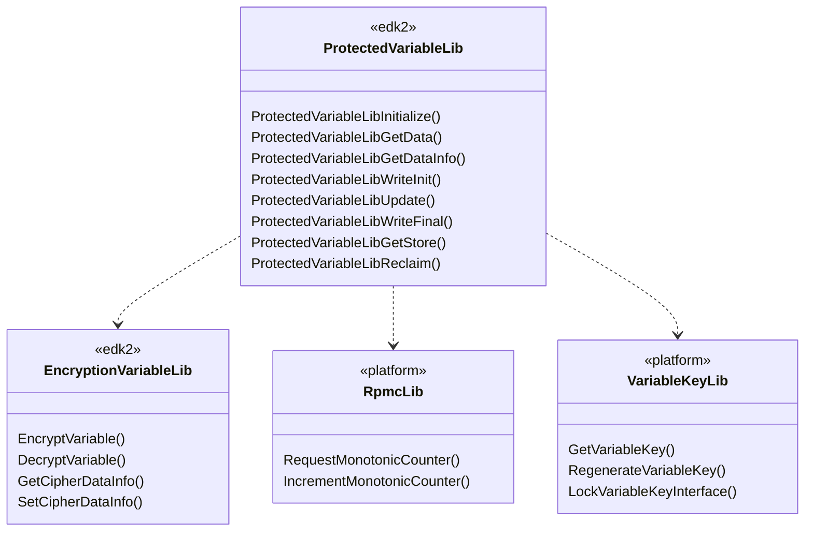
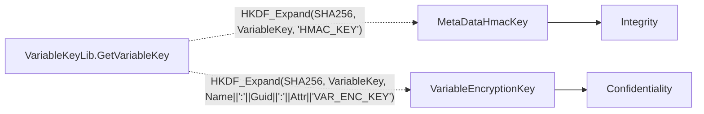
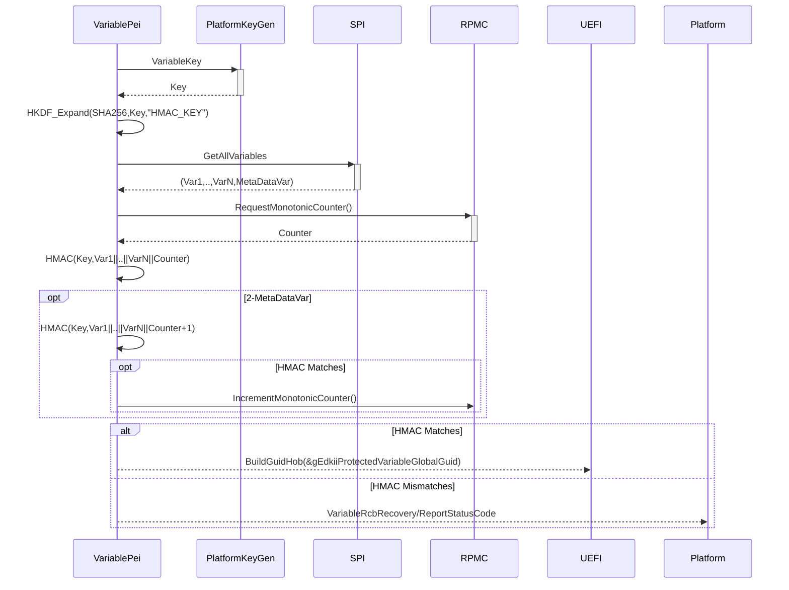
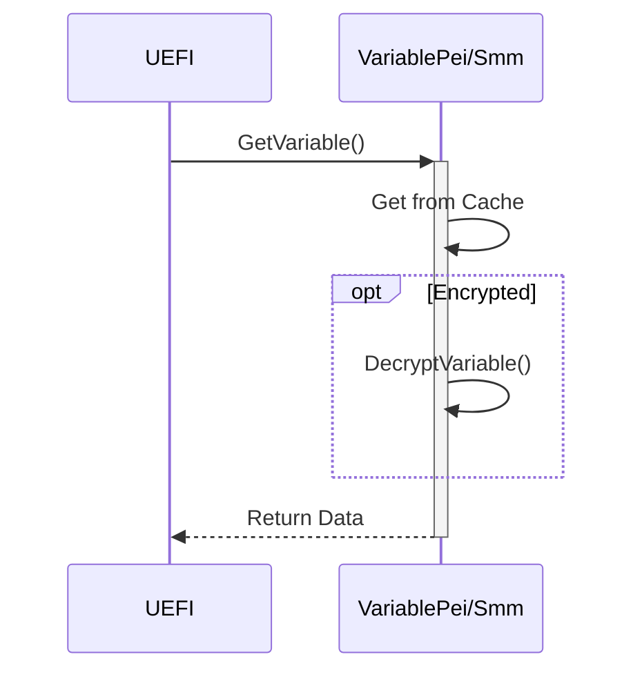
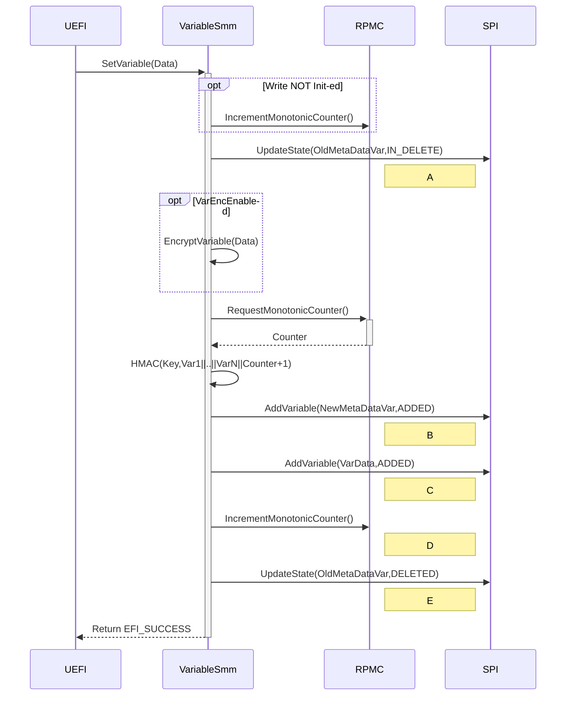

# Variable Integrity and Confidentiality with RPMC

This staging branch introduces new features, integrity and confidentiality with RPMC (Replay Protected Monotonic Counter), into current variable services. Since this is a big add-on, a separate branch can help users to review, evaluate and/or test the new functionalities and potential backward compatibility issues.

## Requirement

From Microsoft Windows 10 [1903](https://go.microsoft.com/fwlink/?linkid=2086856)

```plaintext
“Confidential & replay-protected storage [Optional until 2020]: External memory for non-volatile storage of all UEFI variables and security-sensitive BIOS settings MUST include protections of that data to insure confidentiality and integrity of the data and to mitigate against rollback attacks. This is generally accomplished by encrypting the data, Confidential & replay-protected storage. This is generally accomplished by encrypting the data, applying a Message Authentication Code, and storing the resulting record in replay-protected storage such as Replay Protected Memory Block or Replay Protected Monotonic Counter.”
```

## Architecture

The main functionalities of integrity and confidentiality are provided through [ProtectedVariableLib](https://github.com/tianocore/edk2-staging/blob/ProtectedVariable/libs/SecurityPkg/Include/Library/ProtectedVariableLib.h) library, which employs [EncryptionVariableLib](https://github.com/tianocore/edk2-staging/blob/ProtectedVariable/libs/SecurityPkg/Include/Library/EncryptionVariableLib.h) to do encryption/description works, [RpmcLib](https://github.com/tianocore/edk2-staging/blob/ProtectedVariable/libs/SecurityPkg/Include/Library/RpmcLib.h) to operate Replay Protected Monotonic Counter for replay protection, and [VariableKeyLib](https://github.com/tianocore/edk2-staging/blob/ProtectedVariable/libs/SecurityPkg/Include/Library/VariableKeyLib.h) to access hardware generated root key for integrity check and data encryption for variables.



[RpmcLib](https://github.com/tianocore/edk2-staging/blob/ProtectedVariable/libs/SecurityPkg/Include/Library/RpmcLib.h) and [VariableKeyLib](https://github.com/tianocore/edk2-staging/blob/ProtectedVariable/libs/SecurityPkg/Include/Library/VariableKeyLib.h) rely on platform to provide related functionalities and then should be instantiated by platform. Edk2 only provides null version of instances ([RpmcLibNull](https://github.com/tianocore/edk2-staging/tree/ProtectedVariable/libs/SecurityPkg/Library/RpmcLibNull) and [VariableKeyLib](https://github.com/tianocore/edk2-staging/tree/ProtectedVariable/libs/SecurityPkg/Library/VariableKeyLibNull)) for build purpose. Don't use them in real product.

ProtectedVariableLib will use the key got from VariableKeyLib to derive two keys:

- MetaDataHmacKey, for variable integrity check via HMAC algorithm;
- VariableEncryptionKey, for variable encryption/decryption.



Edk2 provides an instance of [EncryptionVariableLib](https://github.com/tianocore/edk2-staging/tree/ProtectedVariable/libs/SecurityPkg/Library/EncryptionVariableLib), which uses AES-CBC algorithm to encrypt/decrypt variable data. A null version [EncryptionVariableLib](https://github.com/tianocore/edk2-staging/tree/ProtectedVariable/libs/SecurityPkg/Library/EncryptionVariableLibNull) can be used to disable the encryption/decryption functionality. This is for those who just want integrity check for variables.

Edk2 provides four instances of ProtectedVariableLib to support variable services in different environment:

- [PeiProtectedVariableLib](https://github.com/tianocore/edk2-staging/tree/ProtectedVariable/libs/SecurityPkg/Library/ProtectedVariableLib), for PEI variable services
  - Derive MetaDataHmacKey from platform VariableKey
  - Cache all variables and verify their integrity before accessing any variable data, based on current RPMC value
  - Read variable data, after decrypted, if encrypted
  - Pass on all keys and verified variable data via HOB to SMM
- [SmmProtectedVariableLib](https://github.com/tianocore/edk2-staging/tree/ProtectedVariable/libs/SecurityPkg/Library/ProtectedVariableLib), for SMM variable services
  - Derive VariableEncryptionKey from VariableKey
  - Read decrypted variable data from cache
  - Write encrypted variable data to flash
  - Refresh HMAC and update MetaDataHmacVar variable with its value, upon updating any other variable
  - Advance RPMC before the first variable update operation
  - Advance RPMC after any variable update operation
- [SmmRuntimeProtectedVariableLib](https://github.com/tianocore/edk2-staging/tree/ProtectedVariable/libs/SecurityPkg/Library/ProtectedVariableLib), for RuntimeService variable interfaces
  - Read decrypted variable data from cache
  - Pass variable write operation onto SMM
- [DxeProtectedVariableLib](https://github.com/tianocore/edk2-staging/tree/ProtectedVariable/libs/SecurityPkg/Library/ProtectedVariableLib), for emulation environment only
  - Similar to SmmProtectionVariableLib

``` mermaid
classDiagram
    ProtectedVariableLib <|-- PeiProtectedVariableLib
    PeiProtectedVariableLib: ProtectedVariableLibInitialize()
    PeiProtectedVariableLib: ProtectedVariableLibGetData()
    PeiProtectedVariableLib: ProtectedVariableLibGetStore()

    ProtectedVariableLib <|-- SmmProtectedVariableLib
    SmmProtectedVariableLib: ProtectedVariableLibInitialize()
    SmmProtectedVariableLib: ProtectedVariableLibGetData()
    SmmProtectedVariableLib: ProtectedVariableLibGetDataInfo()
    SmmProtectedVariableLib: ProtectedVariableLibWriteInit()
    SmmProtectedVariableLib: ProtectedVariableLibUpdate()
    SmmProtectedVariableLib: ProtectedVariableLibWriteFinal()
    SmmProtectedVariableLib: ProtectedVariableLibGetStore()
    SmmProtectedVariableLib: ProtectedVariableLibReclaim()

    ProtectedVariableLib <|-- SmmRuntimeProtectedVariableLib
    SmmRuntimeProtectedVariableLib: ProtectedVariableLibInitialize()
    SmmRuntimeProtectedVariableLib: ProtectedVariableLibGetData()

    ProtectedVariableLib <|-- DxeRuntimeProtectedVariableLib
    DxeRuntimeProtectedVariableLib: ProtectedVariableLibInitialize()
    DxeRuntimeProtectedVariableLib: ProtectedVariableLibGetData()
    DxeRuntimeProtectedVariableLib: ProtectedVariableLibGetDataInfo()
    DxeRuntimeProtectedVariableLib: ProtectedVariableLibWriteInit()
    DxeRuntimeProtectedVariableLib: ProtectedVariableLibUpdate()
    DxeRuntimeProtectedVariableLib: ProtectedVariableLibWriteFinal()
    DxeRuntimeProtectedVariableLib: ProtectedVariableLibGetStore()
    DxeRuntimeProtectedVariableLib: ProtectedVariableLibReclaim()

    VariablePei ..> PeiProtectedVariableLib
    VariableSmm ..> SmmProtectedVariableLib
    VariableSmmRuntime ..> SmmRuntimeProtectedVariableLib
    VariableRuntimeDxe ..> DxeRuntimeProtectedVariableLib

    link PeiProtectedVariableLib "https://github.com/tianocore/edk2-staging/tree/ProtectedVariable/libs/SecurityPkg/Library/ProtectedVariableLib"
    link SmmProtectedVariableLib "https://github.com/tianocore/edk2-staging/tree/ProtectedVariable/libs/SecurityPkg/Library/ProtectedVariableLib"
    link SmmRuntimeProtectedVariableLib "https://github.com/tianocore/edk2-staging/tree/ProtectedVariable/libs/SecurityPkg/Library/ProtectedVariableLib"
    link DxeRuntimeProtectedVariableLib "https://github.com/tianocore/edk2-staging/tree/ProtectedVariable/libs/SecurityPkg/Library/ProtectedVariableLib"

    link VariablePei "https://github.com/tianocore/edk2-staging/tree/ProtectedVariable/libs/MdeModulePkg/Universal/Variable/Pei"
    link VariableSmm "https://github.com/tianocore/edk2-staging/tree/ProtectedVariable/libs/MdeModulePkg/Universal/Variable/RuntimeDxe"
    link VariableSmmRuntime "https://github.com/tianocore/edk2-staging/tree/ProtectedVariable/libs/MdeModulePkg/Universal/Variable/RuntimeDxe"
    link VariableRuntimeDxe "https://github.com/tianocore/edk2-staging/tree/ProtectedVariable/libs/MdeModulePkg/Universal/Variable/RuntimeDxe"

```



There're two special variables which must not be encrypted or taken into integrity check:
- L"MetaDataHmacVar“ (gEdkiiMetaDataHmacVariableGuid)
  - Store the HMAC value for integrity check
- L"VarErrorFlag" (gEdkiiVarErrorFlagGuid)
  - Record error status when out of resource

## Workflow

- PEI variable services initialization flow



- GetVariable flow



- SetVariable flow



## Platform Integration Considerations

- Instantiate RpmcLib
- Instantiate VariableKeyLib
- Define & implement variable init/recovery policy
- Enable/disable variable integrity check
  - Enable:
    - PEI: SecurityPkg/Library/ProtectedVariableLib/PeiProtectedVariableLib.inf
    - SMM: SecurityPkg/Library/ProtectedVariableLib/SmmProtectedVariableLib.inf
    - Runtime: SecurityPkg/Library/ProtectedVariableLib/SmmRuntimeProtectedVariableLib.inf
  - Disable:
    - (All): SecurityPkg/Library/ProtectedVariableLibNull/ProtectedVariableLibNull.inf
- Enable/disable variable encryption
  - Enable:
    - SecurityPkg/Library/EncryptionVariableLib/EncryptionVariableLib.inf
  - Disable:
    - SecurityPkg/Library/EncryptionVariableLibNull/EncryptionVariableLibNull.inf
