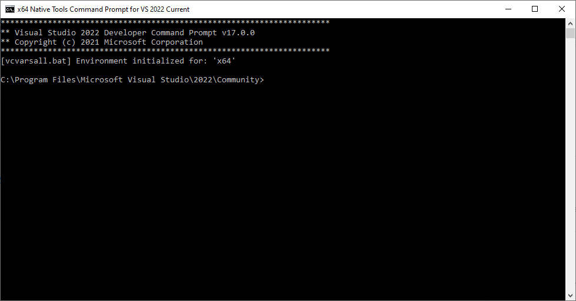
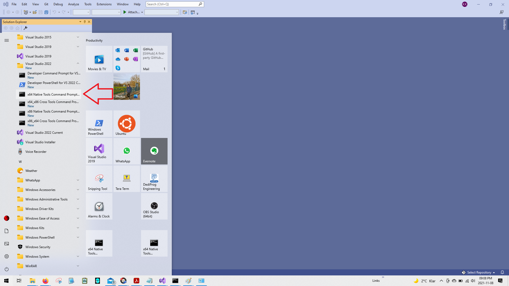
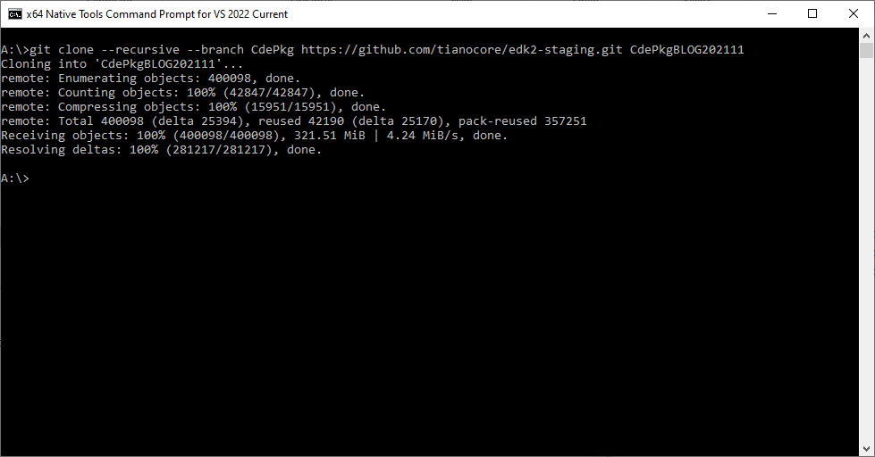
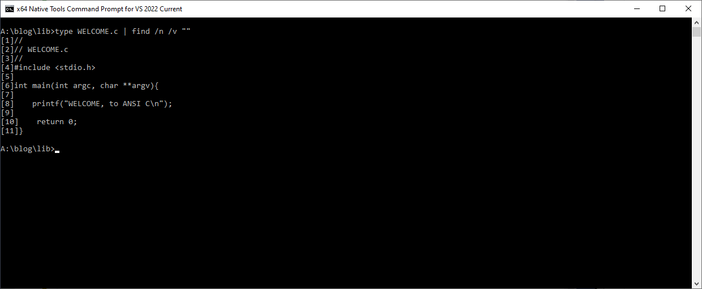
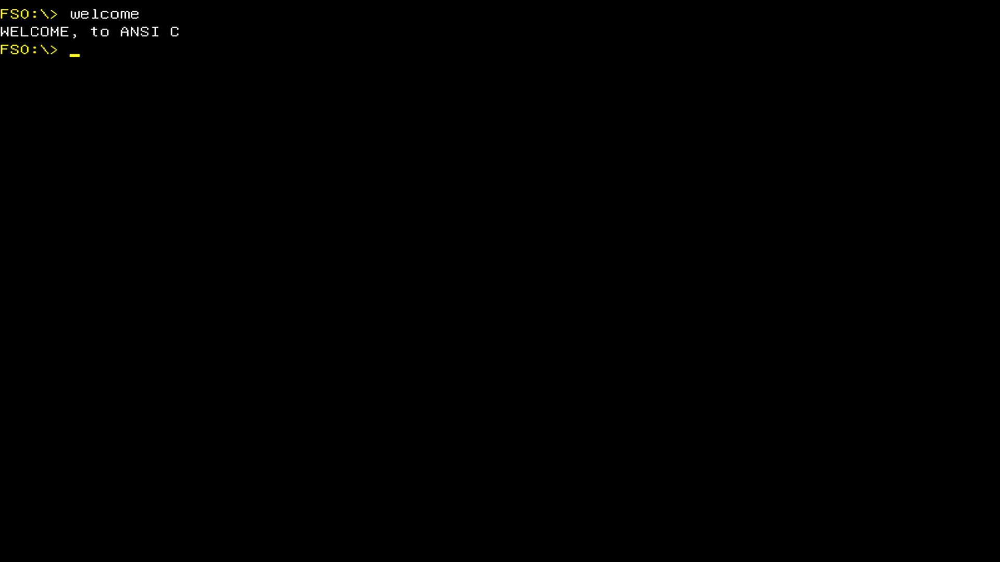
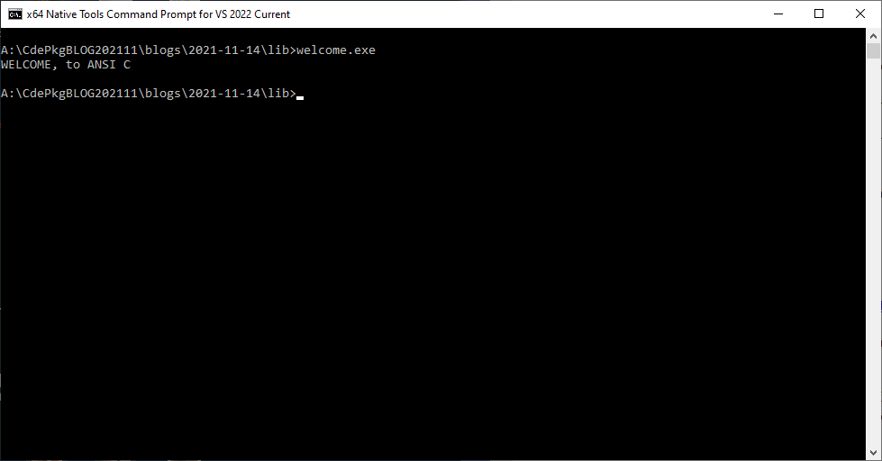
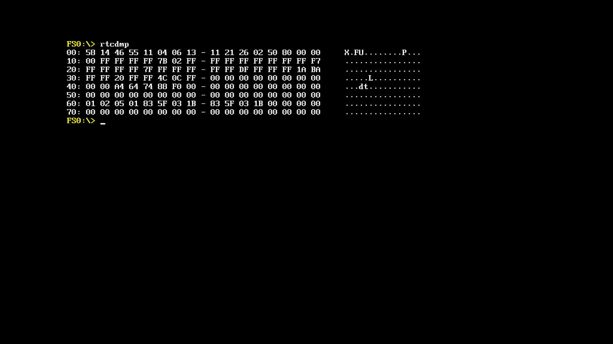

# CdePkgBlog 2021-11-14
### Table of content
* [Abstract](README.md#Abstract)
* [Introduction](README.md#Introduction)
    * [introductory email](https://edk2.groups.io/g/devel/message/83734?p=%2C%2C%2C20%2C0%2C0%2C0%3A%3ACreated%2C%2CCdePkgBlog%2C20%2C2%2C0%2C87053945)
* [Starting Visual Studio](README.md#starting-visual-studio-2022)
* [Using the compiler and linker](README.md#using-the-compiler-and-linker)
    * [Compiling the .C file](README.md#compiling-the-c-file)
    * [Linking the .OBJ module to an UEFI Application](README.md#linking-the-obj-module-to-an-uefi-application)
* [Validating correctness / testing equivalence](README.md#validating-correctness--testing-equivalence)
    * [Linking the .OBJ module to a Windows x64 command line Application](README.md#linking-the-obj-module-to-a-windows-x64-command-line-application)
    * [Linking the .OBJ module to a Windows x64 command line Application based on Microsoft LIBCMT.lib](README.md#linking-the-obj-module-to-a-windows-x64-command-line-application-based-on-microsoft-libcmtlib)
* [Simple tools](README.md#simple-tools)
    * [rtcdmp - RTC dump tool](README.md#rtcdmp---rtc-dump-tool)
    * [rtcwr - RTC write tool](README.md#rtcwr---rtc-write-tool)
    * [iodmp - I/O dump tool](README.md#iodmp---io-dump-tool)
    * [iowr - I/O write tool](README.md#iowr---io-write-tool)
* [My legacy toolbox](README.md#my-legacy-toolbox)
* [Coming up soon](README.md#coming-up-soon)

## Abstract
Demonstration on how to create Standard C UEFI Shell applications, easily and quickly, 
using the latest development environment from Microsoft and the *open source*, *monolithic*, *multi-target* 
[**toro C Library**](https://github.com/KilianKegel/toro-C-Library#toro-c-library-formerly-known-as-torito-c-library)


## Introduction
**Visual Studio 2022** is out now.<br>

In this blog I will introduce native Linux programers, kernel hackers, embedded firmware developers,
former MSDOS programers, teachers and students with a good grasp in C and last, 
but not least, UEFI BIOS engineers to the easiest and fastest of creating native 
Standard C programs for the UEFI Shell.

This is not a beginners´ tutorial. You need to have an idea on how to use a C compiler and linker
in a command line environment, how I/O redirection works and how parameters are
passed to the C application and how to use the most frequently used Standard C functions
like `malloc()`, `printf()` and `scanf()`.

Additionally you need an understanding of the I/O components on an IBM-AT compatible
UEFI platform.

Nowadays C compilers have a lot of non-standard extentions in language, library and so called
*intrinsic* (called *built-in* in the GNU terminolgy) functions to meet platform and developer requirements. I mean I/O functions like
`outp()`/`inp()` family. Those functions will be used here.

To follow the examples listed here please install **Visual Studio 2022** **"Desktop development with C++"** on your x64-Windows host.
https://github.com/KilianKegel/HowTo-setup-an-UEFI-Development-PC#howto-setup-an-uefi-development-pc

## Starting **Visual Studio 2022**
**Visual Studio 2022** looks like this:


It contains the C compiler `cl.exe`, the linker `link.exe`, the COFF/PE Dumper and disassembler `dumpbin.exe`, the library manager
`lib.exe`, the legacy make tool `nmake.exe`, the new build engine `msbuild.exe` and many, many others. <br>
I will focus on compiler, linker, disassembler and librarian only.

To start this command line window, go to:
1. Start
2. Visual Studio 2022
3. x64 Native Tools Command Prompt for VS2022 Current




After starting the VS2022CLI (command line interface) go to your builddrive and type:<br>
`git clone --recursive --branch CdePkg https://github.com/tianocore/edk2-staging.git CdePkgBLOG202111`

It will look similiar to this:


Change into the `blogs\2021-11-14` folder by typing:<br>
`cd blogs\2021-11-14`<br>
and type: `type WELCOME.c | find /n /v ""` to see what `WELCOME.c` truly is.


It is a simple C99-Standard-compatible HelloWorld program, that
uses C99 `//`-style comments.

## Using the compiler and linker
### Compiling the .C file
You can compile the sample WELCOME.c source module to its corresponding .OBJ module:<br>
`cl /nologo /c /GS- /D_NO_CRT_STDIO_INLINE /D_CRT_SECURE_NO_WARNINGS WELCOME.c`

What does this mean?<br>
1. `cl` is the Microsoft C/C++ compiler
2. `/nologo` supresses the copyright message
3. `/c` only compiles, does not invoke LINK.EXE
4. `/GS-` disables stack checks, as in tianocore UEFI build settings
5. `/D_NO_CRT_STDIO_INLINE` a preprocessor defininition that forces the compiler to generate true `printf()` and `scanf()` function calls and to prevent from inlining these functions
6. `/D_CRT_SECURE_NO_WARNINGS` a preprocessor defininition that prevents from bothering about `*_s` secure counterpart
7. `WELCOME.c`is the source module

### Linking the .OBJ module to an UEFI Application
You can link the sample WELCOME.OBJ module to its corresponding .EFI module:<br>
`link /nologo /NODEFAULTLIB /ENTRY:_cdeCRT0UefiShell /OUT:welcome.efi /SUBSYSTEM:EFI_APPLICATION /MAP:WELCOMEUefiShell.map WELCOME.obj toroC64.lib`<br>
1. `link` is the Microsoft linker
2. `/nologo` supresses the copyright message
3. `/NODEFAULTLIB` excludes all default libraries
4. `/ENTRY:_cdeCRT0UefiShell` the name of the particular `CRT0` (*C runtime 0*) function, that is the entry point in **toroC64.lib**
5. `/OUT:welcome.efi` the file name of the executable
6. `/SUBSYSTEM:EFI_APPLICATION` forces the linker to create a `EFI_APPLICATION` executable
7. `/MAP:WELCOMEUefiShell.map` the name of the .MAP file
8. `WELCOME.obj`  the .OBJ module
9. `toroC64.lib` the only search library in uses during the link process

It is easy to guess how WELCOME.efi's output would look like:<br>



## Validating correctness / testing equivalence
But if you plan to create and validate a full-blown Standard C library for UEFI Shell and POST, 
written from scratch, it would be helpful, if a major part of the test cases 
* `printf()`/`scanf()` family format strings
* `malloc()`/`free()`/`realloc()`
* string and wide string handling functions
* file buffering etc.
* simply all functions listed here: https://github.com/KilianKegel/toro-C-Library/blob/master/implemented.md

could be tested and debugged natively on the build machine, and need not to be copied to the UEFI target each time.

NOTE: In early states of the **toro C Library** *construction bootstrap process* the `EmulatorPkg` 
was deeply involved. But for UEFI-non-specific parts of the library, the multi-entrypoint feature
was used predominantly to debug natively on the build machine.


### Linking the .OBJ module to a Windows x64 command line Application
That could be easily done by linking `WELCOME.OBJ` to a Windows NT console executable <br>
`link /nologo /NODEFAULTLIB /ENTRY:_cdeCRT0WinNT /OUT:welcome.exe /SUBSYSTEM:CONSOLE /MAP:WELCOMEWinNT.map WELCOME.obj toroC64.lib kernel32.lib`<br>

Some parameters have changed:<br>
1. `/ENTRY:_cdeCRT0WinNT` `CRT0` for Windows NT executables in **toroC64.lib**
2. `/OUT:welcome.exe` the file name of the executable
3. `/SUBSYSTEM:CONSOLE` forces the linker to create a Windows NT executable
4. `/MAP:WELCOMEWinNT.map` the name of the .MAP file
5. `kernel32.lib` the import library to the Win32 API

It is easy to guess how WELCOME.exe's output would look like:<br>


### Linking the .OBJ module to a Windows x64 command line Application based on Microsoft LIBCMT.lib
If you still doubt, that WELCOME's `WELCOME, to ANSI C` written to the UEFI Shell and Windows text console
does not meet the Standard C format specification for `printf()`, just try to link the .OBJ module to the original Microsoft LIBCMT.lib, is not 
suspicious to violate the C Standard generally:<br>
`link /nologo /OUT:welcomeMSFT.exe /SUBSYSTEM:CONSOLE /MAP:WELCOMEMsft.map WELCOME.obj kernel32.lib legacy_stdio_definitions.lib`<br>

Some parameters have changed:<br>
1. `/NODEFAULTLIB` is removed, since the default Microsoft LIBCMT.lib shall be bound to the .EXE
2. `/ENTRY` is not needed anymore, because LINK.EXE knows the name of the default `CRT0`
3. `/OUT:welcomeMSFT.exe` to mark the difference
4. `/MAP:WELCOMEMsft.map`  the name of the .MAP file
4. `legacy_stdio_definitions.lib`  an additional Microsoft library that includes functions that are not
   provided anymore in LIBCMT.lib, but belong to Standard C. The linker finds that file in the default LIB search path.

## Simple tools
Here I will demonstrate the early ports from my old MSDOS tools to UEFI.<BR>
**NOTE: All the source files are in the root directory of this blog, and not in the `lib`
subdirectory. <BR>
For LINK.EXE the path and name of the **toro C Library** is needed now `lib\toroC64.lib`**

These tools all directly access hardware. Therefore UEFI specific header-files and EDK2 build
tools/engine are not needed.

### rtcdmp - RTC dump tool
During legacy times it was often necessary to find out, what is in the 
non-volatile / battery-bufferd RealTimeClock MC146818 chip, that still belongs
to the PC hardware architecture. It contains an alarm clock, that is still used
to wake the platform nowadays. And it contains additional battery buffered RAM (NVRAM), 
about 112 bytes, that was used to store setup settings.

Today only a small number of NVRAM is used, very platform dependant for scratch-pad usage
for memory detection purposes and so on.

The century byte at offset 0x32 is still there. The first 16 bytes represent the data and
control registers of the clock circuitry.

```c
[1]     //
[2]     // RTC dump tool
[3]     //
[4]     //  Copyright(c) 2017 - 2021, Kilian Kegel.All rights reserved.
[5]     //  SPDX - License - Identifier: BSD-2-Clause-Patent
[6]     //
[7]     #include <stdio.h>
[8]     #include <stdlib.h>
[9]     #include <ctype.h>
[10]    
[11]    unsigned char getitem(int index)
[12]    {
[13]        //NOTE: "update in progress" is ignored
[14]        outp(0x70, index);                          // write the index
[15]        return (unsigned char)inp(0x71);            // get the data
[16]    }
[17]    
[18]    int main()
[19]    {
[20]        int i;
[21]    
[22]        for (i = 0; i < 128; i++)
[23]        {
[24]            int l;
[25]            unsigned char linebuf[16];
[26]    
[27]            if (0 == (i % 16))                      //
[28]                printf("%02X: ", i);                // print the address
[29]            linebuf[i % 16] = getitem(i);           // get the value to a temporary line buffer
[30]            printf("%02X ", linebuf[i % 16]);       // print the value in hex format
[31]                                                    //
[32]            if (0 == ((i + 1) % 8)                  // check mid of line
[33]                && 0 != ((i + 1) % 16))             //
[34]                printf("- ");                       // print the separator
[35]                                                    //
[36]            if (0 == ((i + 1) % 16))                // check end of line
[37]            {                                       //
[38]                printf("    ");                     // insert space after hex print,
[39]                for (l = 0; l < 16; l++)            // print ASCII representation
[40]                    printf("%c", isalnum(linebuf[l]) ? 0xFF & linebuf[l] : '.');
[41]                printf("\n");                       // new line
[42]            }
[43]        }
[44]        return EXIT_SUCCESS;
[45]    }
```
Compile and link:<br>
`cl /nologo /c /GS- /D_NO_CRT_STDIO_INLINE /D_CRT_SECURE_NO_WARNINGS rtcdmp.c`<br><br>
`link /nologo /NODEFAULTLIB /ENTRY:_cdeCRT0UefiShell /SUBSYSTEM:EFI_APPLICATION rtcdmp.obj lib\toroC64.lib`<br>

It looks like this:<br>



### rtcwr - RTC write tool
Sometimes you need to alter a register/NVRAM byte in the RTC.<br>
`rtcwr 32 19` would change the century byte to 19 (because it is BCD encoded):

```c
[1]     //
[2]     // RTC write tool
[3]     //
[4]     //  Copyright(c) 2017 - 2021, Kilian Kegel.All rights reserved.
[5]     //  SPDX - License - Identifier: BSD-2-Clause-Patent
[6]     //
[7]     #include <stdio.h>
[8]     #include <stdlib.h>
[9]     
[10]    int setitem(int index, int data)
[11]    {
[12]        outp(0x70, index);
[13]        outp(0x71, data);
[14]        return 0;
[15]    }
[16]    
[17]    int main(int argc, char** argv)
[18]    {
[19]        int index, data, t;
[20]    
[21]        if (argc < 3) {
[22]            printf("ERROR: RTCwr missing parameter, use:\n    RTCwr index value -- hex format\n");
[23]            exit(1);
[24]        }
[25]    
[26]        t = sscanf(argv[1], "%x", &index);
[27]        t = sscanf(argv[2], "%x", &data);
[28]        // additionally the numbers of tokens scanned can be checked, ignored here
[29]    
[30]        setitem(index, data);
[31]    
[32]    }
```
### iodmp - I/O dump tool
Quite often an UEFI engineer needs to know, if a particular I/O range or device
is enabled/disabled and the CPU I/O cycles truly reach the device.

An IOdmp tool could be useful in such cases: [IOdmp.c](iodmp.c)

### iowr - I/O write tool
Quite often an UEFI engineer needs to write to an I/O address. E.g. to
set COM1 (0x3F8 base) to 115200,n,8,1 and send a byte to an terminal program.
The command flow would look like that one:<br>
```
iowr 3FB 83
iowr 3F8 1
iowr 3F9 0
iowr 3FB 3

iowr 3F8 55
```

This would send a "U" over the serial line.

An IOwr tool could be useful in such cases: [IOwr.c](iowr.c)

## My legacy toolbox
From now on it is an easy and repetitive task to adjust Dump and Write
tools for *memory*, *PCI* and *SuperIO* too. Additionally 16, 32 and 64bit (memory only)
access would be useful.

Just invoke [**BUILD.bat**](build.bat) to create the .EFI applications from the files
listed below

[iodmp.c ](iodmp.c), [iodmp16.c ](iodmp16.c), [iodmp32.c ](iodmp32.c), <br>
[iowr.c    ](iowr.c), [iowr16.c  ](iowr16.c), [iowr32.c  ](iowr32.c), <br>
[memdmp.c  ](memdmp.c), [memdmp16.c](memdmp16.c), [memdmp32.c](memdmp32.c), [memdmp64.c](memdmp64.c), <br>
[memwr.c   ](memwr.c), [memwr16.c ](memwr16.c), [memwr32.c ](memwr32.c), [memwr64.c ](memwr64.c),<br>
[pcidmp.c  ](pcidmp.c), [pcidmp16.c](pcidmp16.c), [pcidmp32.c](pcidmp32.c), <br>
[pciwr.c   ](pciwr.c), [pciwr16.c ](pciwr16.c), [pciwr32.c ](pciwr32.c), <br>
[rtcdmp.c  ](rtcdmp.c), <br>
[rtcwr.c   ](rtcwr.c),<br>
[siodmp.c  ](siodmp.c)<br>

	
## Coming up soon...
1. 2021-11-28:<br>
    * Using UEFI- and Standard-C-API in shell applications<br>
    * Creating MSDOS tools.<br>
2. 2021-12-12:<br>
    * Adopting open source Visual-Studio projects to UEFI<br>
    * Introduction of the ACPCIA port to UEFI<br>
3. 2022-09-01:<br>
    * Introduction of how to calibrate a TSC-based software timer - on IBM-AT compatible UEFI platforms

