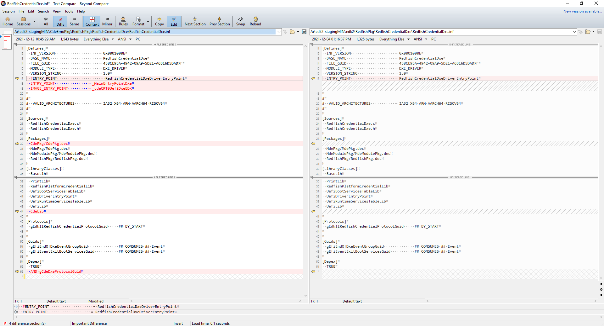
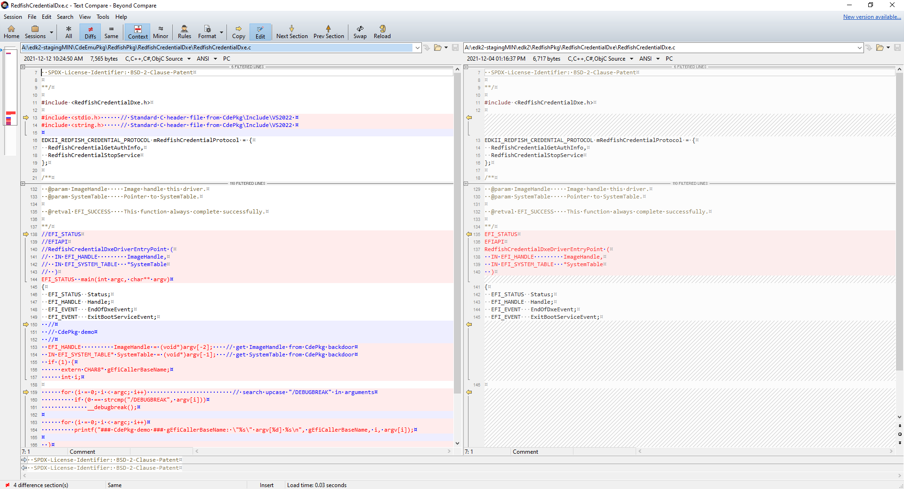
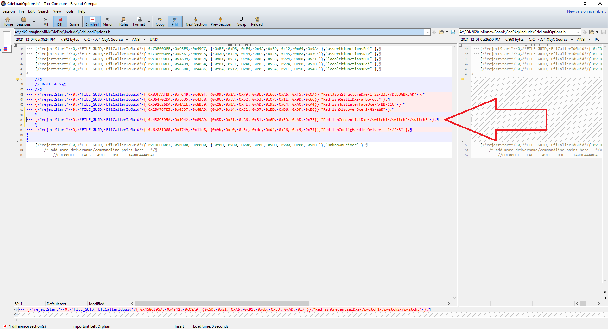

### CdePkgBlog 2021-12-19
# Redfish on CdePkg

### Table of content
* [Abstract](README.md#Abstract)
* [Introduction](README.md#Introduction)
    * [introductory email](https://edk2.groups.io/g/devel/topic/cdepkgblog_2021_12_19/87843834?p=,,,20,0,0,0::recentpostdate/sticky,,,20,2,0,87843834,previd=1639947117658429604,nextid=1639753762684061333&previd=1639947117658429604&nextid=1639753762684061333)
* [In a nutshell: **CdePkg**](README.md#in-a-nutshell-cdepkg)
    * [A short comparison with RedfishCrtLib](README.md#a-short-comparison-with-redfishcrtlib)
    * [RedfishCrtLib conflicts with CdePkg by design](README.md#redfishcrtlib-conflicts-with-cdepkg-by-design)
* [Transformation of a traditional UEFI DXE driver to CdePkg driver](README.md#transformation-of-a-traditional-uefi-dxe-driver-to-cdepkg-driver)
    * [Adjusting the .INF file to run CdePkg features](README.md#adjusting-the-inf-file-to-run-cdepkg-features)
    * [Adjusting the ENTRY_POINT-.C file to run CdePkg features](README.md#adjusting-the-entry_point-c-file-to-run-cdepkg-features)
    * [Adding a command line (EmulatorPkg)](README.md#adding-a-command-line-emulatorpkg)
    * [Adding a command line on a real platform](README.md#adding-a-command-line-on-a-real-platform)
* [Perform Standard C in RestJsonStructureDxe.c in the Emulator](README.md#perform-standard-c-in-restjsonstructuredxec-in-the-emulator)
    * [`wctype.h` demonstration](README.md#wctypeh-demonstration)
    * [`wchar.h` demonstration](README.md#wcharh-demonstration)
* [CDETRACE() -- An introduction of a new DEBUG/TRACE concept for UEFI platforms](README.md#cdetrace----an-introduction-of-a-new-debugtrace-concept-for-uefi-platforms)
    * [tianocore `DEBUG()`](README.md#cdetrace----an-introduction-of-a-new-debugtrace-concept-for-uefi-platforms)
    * [`CDETRACE()`](README.md#cdetrace)
* [Coming up soon](README.md#coming-up-soon)

## Abstract
Demonstration on how to transform existing UEFI POST drivers to run in a *hosted environment*, starting at 
`int main(int argc, char **argv)` and taking arguments from an *emulated* or a NVRAM stored command line, 
using the latest development environment from Microsoft and the *open source*, *monolithic*, *multi-target* 
[**toro C Library**](https://github.com/KilianKegel/toro-C-Library#toro-c-library-formerly-known-as-torito-c-library)

NOTE: All statements regarding implementation specific details of **toro C Library** are always strictly focused on
my observations of Microsoft C Library, running "C" locale, at UTC timezone. Referring to Standard/ANSI C might be a 
Microsoft specific implementation of the specification, but I always give my best to double-check the statements on GCC x64. In critical cases
also old Borland, Watcom and Digital Mars C compiler and library were queried. **toro C Library** is engineered -- not "scientifized".
This is also true for all upcoming CdePkgBlogs.

## Introduction

The transformation of current UEFI drivers, that run traditionally in a "limited" [*freestanding environment*](http://www.open-std.org/JTC1/SC22/WG14/www/docs/n1256.pdf#page=23) 
to drivers running in a full blown [*hosted environment*](http://www.open-std.org/JTC1/SC22/WG14/www/docs/n1256.pdf#page=23) (that currently 
provides a comprehensive -- but not yet full -- set of [Standard C functions](https://github.com/KilianKegel/toro-C-Library/blob/master/implemented.md)) is demonstrated along the [**RedfishPkg**](https://github.com/tianocore/edk2/tree/master/RedfishPkg#uefi-redfish-edk2-implementation).

I call this execution environment "*limited freestanding environment*", because for C99-[`long long`]((http://www.open-std.org/JTC1/SC22/WG14/www/docs/n1256.pdf#page=45))-data-type
integer shift and divided operators can not be used with the 32 bit codegenerator. E.g. a source code snippet like
```c
    if(1)
    {
        volatile long long longlong = 3;

        while(longlong / 7);
    }
```

will fail to link the driver with `error LNK2001: unresolved external symbol __alldiv` in the Microsoft tool chain.<br>
NOTE: In GNU tool chain it will fail for the very same reason with a similiar message.

Once, the driver is transformed to be a **CdePkg**-based driver this type of error  cannot appear anymore.

NOTE: Currently **CdePkg** is only available for Microsoft tool chain. It is planned to provide the same functionality
for GNU and LLVM based tool chains, too.

ATTENTION: DON'T TRY TO USE **toro C Library** and **CdeLib.lib** with the GNU linker! The GNU linker used to contain
bugs regarding MS-COFF .OBJ format and maybe there are still some more bugs beside those that were already found and solved: https://github.com/KilianKegel/GNU-ld-for-MicrosoftCOFF-to-LinuxELF#gnu-ld-for-microsoftcoff-to-linuxelf

# In a nutshell: **CdePkg**
[**CdePkg**](https://github.com/KilianKegel/CdePkg#cdepkg) was introduced to ease porting 
of Standard C source code to UEFI drivers and to overcome the "barrier"
in front of the open source **tianocore** project. 

The "barrier" of **tianocore** exists and is kept up by three reasons:<br>
1. introduction of unique data types
2. substitution of shift and divide operators for 64 bit integers
3. absence of any Standard C functions from [chapter 7](http://www.open-std.org/JTC1/SC22/WG14/www/docs/n1256.pdf#page=176) of the C specification [ISO/IEC 9899](http://www.open-std.org/JTC1/SC22/WG14/www/docs/n1256.pdf#page=1)
	
Item (3) of the above list implies one positive argument:
Since none of the Standard C Library functions are provided by the native UEFI (Library) API at all, none of the Standard C functions
could be implemented faultily.<br>

The design rules below apply to **CdePkg**:<br>
1. reimplementing/cloning all C90/C95-related functions of the Microsoft C Library
    * reimplementing exact behaviour (NOTE: original Microsoft C Library source code is *not* available to me -- this is a [clean room design](https://en.wikipedia.org/wiki/Clean_room_design))
2. multi platform targets
    * **CdePkg**/**toro C Library** based programs can be linked to run on Windows NT too. (Linux support is under construction)
    * <ins>this *core feature* is the basis to compare behaviour against original Microsoft C Library<ins>
3. verified functionality of each [available function](https://github.com/KilianKegel/toro-C-Library/blob/master/implemented.md#validation-status), publishing [known bugs](https://github.com/KilianKegel/toro-C-Library#known-bugs) (e.g. missing floating point format specifiers)
    * in principle: ***once a (faulty) API is published, application code relies on it and the API cannot be fixed anymore***
4. space optimization
    * each single function has its own C source file and gets its own .OBJ in the library and is pulled into the driver separately from any other function. Only `CRT0` modules were excluded from this concept, because `CRT0` modules are used to control the random .LIB/.OBJ link sequence in the UEFI build process.
    * split architecture into worker driver (`CdeServices`) and wrapper functions (`CdeLib.lib`) for POST UEFI drivers to prevent from code space explosion
	if `printf()`, `scanf()` and `malloc()` is duplicated in > 100 different drivers of a particular UEFI BIOS
5. introduction of *hosted environment* for POST drivers
6. introduction of an improved DEBUG-TRACE-capability, as a design concept: `CDETRACE(msg_cond)`
    * <ins>enable format string and parameter validation by the compiler</ins> to prevent from [[1](https://bugzilla.tianocore.org/show_bug.cgi?id=3257)], [[2](https://bugzilla.tianocore.org/show_bug.cgi?id=3253)] and related bugs
    * unlimited string length
    * automatically include *ORIGIN* of the trace: module-, file-, function-name + line number into trace message (time stamp on demand)
    * configurable *SEVERITY* string (`INFO`, `WARNING`, `ERROR`, `FATAL` ...)
    * traces can be controlled *per driver* to prevent message overhead, speed up TRACE-POST
    * using existing `DEBUG()` macros in **CdePkg**-enabled drivers
		

## A short comparison with **RedfishCrtLib**
On the one hand, a recent [**RedfishCrtLib.c**](https://github.com/tianocore/edk2/blob/master/RedfishPkg/PrivateLibrary/RedfishCrtLib/RedfishCrtLib.c) 
and [**RedfishCrtLib.h**](https://github.com/tianocore/edk2/blob/master/RedfishPkg/Include/Library/RedfishCrtLib.h)
introduce a **short-term** approach. That was taken from `CryptoPkg` CrtLibSupport and is also used in `RegularExpressionDxe`and `BrotliDecompressLib`.

[**RedfishCrtLib.h**](https://github.com/tianocore/edk2/blob/master/RedfishPkg/Include/Library/RedfishCrtLib.h#L529)
```c
    .
    .
    .
#define snprintf(buf, len, ...)                       RedfishAsciiSPrint(buf,len,__VA_ARGS__)
#define vsnprintf(buf, len, format, marker)           RedfishAsciiVSPrint((buf),(len),(format),(marker))
    .
    .
    .
```
[`snprintf()`](http://www.open-std.org/JTC1/SC22/WG14/www/docs/n1256.pdf#page=302) and 
[`vsnprintf()`](http://www.open-std.org/JTC1/SC22/WG14/www/docs/n1256.pdf#page=306) are specified by [ISO/IEC 9899](http://www.open-std.org/JTC1/SC22/WG14/www/docs/n1256.pdf#page=1).
It is not sufficent just to replace the `%s`to `%a`, the entire format specifiers have to be supported:<br>
(http://www.open-std.org/JTC1/SC22/WG14/www/docs/n1256.pdf#page=287)

[**`RedfishCrtLib.c`**](https://github.com/tianocore/edk2/blob/master/RedfishPkg/PrivateLibrary/RedfishCrtLib/RedfishCrtLib.c#L1014)
```c
/**
  This is the Redfish version of CRT vsnprintf function, this function replaces "%s" to
  "%a" before invoking AsciiVSPrint(). That is because "%s" is unicode base on edk2
  environment however "%s" is ascii code base on vsnprintf().
  See definitions of AsciiVSPrint() for the details.
    .
    .
    .
**/ 
```

	
The content of the standard header files is not arbitrary! It is defined in the [ISO/IEC 9899](http://www.open-std.org/JTC1/SC22/WG14/www/docs/n1256.pdf#page=1) specification (here only C90/C95 header files listed)
and there is only a little margin to be "creative":<br>
* [`assert.h`](http://www.open-std.org/JTC1/SC22/WG14/www/docs/n1256.pdf#page=261), read https://publications.gbdirect.co.uk/c_book/chapter9/diagnostics.html
* [`ctype.h`](http://www.open-std.org/JTC1/SC22/WG14/www/docs/n1256.pdf#page=193), read https://publications.gbdirect.co.uk/c_book/chapter9/character_handling.html
* [`errno.h`](http://www.open-std.org/JTC1/SC22/WG14/www/docs/n1256.pdf#page=198)
* [`float.h`](http://www.open-std.org/JTC1/SC22/WG14/www/docs/n1256.pdf#page=209)
* [`limits.h`](http://www.open-std.org/JTC1/SC22/WG14/www/docs/n1256.pdf#page=215), read https://publications.gbdirect.co.uk/c_book/chapter9/limits.html 
* [`locale.h`](http://www.open-std.org/JTC1/SC22/WG14/www/docs/n1256.pdf#page=216), read https://publications.gbdirect.co.uk/c_book/chapter9/localization.html 
* [`math.h`](http://www.open-std.org/JTC1/SC22/WG14/www/docs/n1256.pdf#page=224), read https://publications.gbdirect.co.uk/c_book/chapter9/maths_functions.html
* [`setjmp.h`](http://www.open-std.org/JTC1/SC22/WG14/www/docs/n1256.pdf#page=255), read https://publications.gbdirect.co.uk/c_book/chapter9/nonlocal_jumps.html
* [`signal.h`](http://www.open-std.org/JTC1/SC22/WG14/www/docs/n1256.pdf#page=258), read https://publications.gbdirect.co.uk/c_book/chapter9/signal_handling.html
* [`stdarg.h`](http://www.open-std.org/JTC1/SC22/WG14/www/docs/n1256.pdf#page=261), read https://publications.gbdirect.co.uk/c_book/chapter9/stdarg.html
* [`stddef.h`](http://www.open-std.org/JTC1/SC22/WG14/www/docs/n1256.pdf#page=266)
* [`stdint.h`](http://www.open-std.org/JTC1/SC22/WG14/www/docs/n1256.pdf#page=267), C99 but nice to have
* [`stdio.h`](http://www.open-std.org/JTC1/SC22/WG14/www/docs/n1256.pdf#page=274), read https://publications.gbdirect.co.uk/c_book/chapter9/input_and_output.html
* [`stdlib.h`](http://www.open-std.org/JTC1/SC22/WG14/www/docs/n1256.pdf#page=318), read https://publications.gbdirect.co.uk/c_book/chapter9/general_utilities.html
* [`string.h`](http://www.open-std.org/JTC1/SC22/WG14/www/docs/n1256.pdf#page=337), read https://publications.gbdirect.co.uk/c_book/chapter9/string_handling.html
* [`time.h`](http://www.open-std.org/JTC1/SC22/WG14/www/docs/n1256.pdf#page=350), read https://publications.gbdirect.co.uk/c_book/chapter9/date_and_time.html
* [`wchar.h`](http://www.open-std.org/JTC1/SC22/WG14/www/docs/n1256.pdf#page=360), C99 but strongly required for UEFI
* [`wctype.h`](http://www.open-std.org/JTC1/SC22/WG14/www/docs/n1256.pdf#page=405), C99 but strongly required for UEFI

#### NOTE: <ins>If it keeps true that the **RedfishCrtLib**-functions differ from specified  Standard C functions and the header files are kept although holding the wrong content, the advantage of portability **turns into untrustworthiness**. In this case the smallest change in parameters or programflow always requires a full validation of the entire module.</ins>

On the other hand, the **toro C Library**/**CdePkg**
* each single function's behaviour is tested painstakingly against its Microsoft C Library counterpart
* each single format specifier of the [`scanf()`](http://www.open-std.org/JTC1/SC22/WG14/www/docs/n1256.pdf#page=294)- and [`print()`](http://www.open-std.org/JTC1/SC22/WG14/www/docs/n1256.pdf#page=287)-family functions is validated meticulously
    * NOTE: This does not guarantee it to be bug-free 
* a true (partial) validation using [**SuperTest**](https://solidsands.com/products/supertest) is in preparation

## **`RedfishCrtLib`** conflicts with **`CdePkg`** by design
The full **CdePkg**-function-set is only functional when **`RedfishCrtLib`** is NOT being used at all.
This is because the [**RedfishCrtLib.c**](https://github.com/tianocore/edk2/blob/master/RedfishPkg/PrivateLibrary/RedfishCrtLib/RedfishCrtLib.c)
implements all functions in one monolithic .C/.OBJ file. 

Doing so, it violates the ***one definition rule***.

If during the link process *one* single function from `RedfishCrtLib` is invoked,  (*e.g. a new function called [`isdchar()`](https://github.com/tianocore/edk2/blob/master/RedfishPkg/PrivateLibrary/RedfishCrtLib/RedfishCrtLib.c#L40)
that is yet unknown to any Standard/ANSI/POSIX-C specification but pretty much sounds like it belongs to the `ctype.h` functions and for that reason its existence and naming irritates*)
then at the same time all the other functions/symbols will be tried to be pulled in by the linker. If the linker has already found
a function/symbol with the same name in another .OBJ module, it conflicts with `RedfishCrtLib.obj` and will break the build.


    RedfishCrtLib.lib(RedfishCrtLib.obj) : error LNK2005: _fprintf already defined in CdeLib.lib(Fprintf.obj)
    RedfishCrtLib.lib(RedfishCrtLib.obj) : error LNK2005: _fwrite already defined in CdeLib.lib(Fwrite.obj)
    RedfishCrtLib.lib(RedfishCrtLib.obj) : error LNK2005: _free already defined in CdeLib.lib(Free.obj)
    RedfishCrtLib.lib(RedfishCrtLib.obj) : error LNK2005: _malloc already defined in CdeLib.lib(Malloc.obj)
    RedfishCrtLib.lib(RedfishCrtLib.obj) : error LNK2005: _isalnum already defined in CdeLib.lib(isalnum.obj)

The 29 symbols below were defined in the monolitic `RedfishCrtLib.lib`/`RedfishCrtLib.obj` "translation unit" and could not be handled
separately by LINK.EXE and will lead to LNK2005 https://docs.microsoft.com/en-us/cpp/error-messages/tool-errors/linker-tools-error-lnk2005?view=msvc-170:

    errno
    errnum_message
    _fltused
    isalnum()
    isdchar()
    isspace()
    malloc()
    free()
    strdup()
    toupper()
    Digit2Val()
    strtoll()
    strtol()
    strtod ()
    strpbrk()
    strerror()
    calloc()
    time()
    qsort()
    fgetc()
    fopen()
    fread()
    fwrite()
    fclose()
    fprintf()
    CheckFormatingString()
    ReplaceUnicodeToAsciiStrFormat()
    RedfishAsciiVSPrint()
    RedfishAsciiSPrint()

#### NOTE: <INS>**In a proper library design every single symbol should be placed in a dedicated "translation unit"/.OBJ module. The library manager creates a .LIB/library from one or more of those *single-symbol*-.OBJ files. Then the linker can pick each symbol independently from remaining library content.**</INS>

#### NOTE: <ins>**THIS IS A VERY COMMON DESIGN FLAW IN THE UEFI ENVIRONMENT AND THE ROOT CAUSE FOR LOTS OF DIFFICULTIES WHEN DOING CUSTOMIZATIONS ON tianocore/UEFI BASED COMMERCIAL FIRMWARE PRODUCTS.**</ins>


# Transformation of a traditional UEFI DXE driver to **CdePkg** driver
## Adjusting the .INF file to run CdePkg features
The transformation is so easy that it could be done by a simple program or script, e.g. `Mde2Cde.py`.


For all **CdePkg** based DXE drivers the entry point definitions must be set to:<br>
(for more information read the background information below)
```
ENTRY_POINT               = _MainEntryPointDxe
IMAGE_ENTRY_POINT         = _cdeCRT0UefiDxeEDK
```

In the `[Packages]` section the `CdePkg/CdePkg.dec` must precede the other packages, 
because otherwise for **RedfishPkg** an already faultily implemented [`stdlib.h`](https://raw.githubusercontent.com/tianocore/edk2/master/RedfishPkg/PrivateInclude/Crt/stdlib.h)
leads to build errors (e.g. `atoi()` function not declarated).<br>
NOTE: The order of  the packages determines the search-order of the include-folders.
	
In the `[LibraryClasses]` section just the `CdeLib` needs to be added. `CdeLib`.lib is derived
from the original **toro C Library** binary.

In the `[Depex]` section an additional dependency from the `CdeServices`-driver is needed.
All **CdePkg** based drivers run `printf()`, `scanf()`, `malloc()` and other code size relevant functions
from a "worker"-driver: `CdeServices`. For the DXE phase those services were provided by a protocol with the GUID: `gCdeDxeProtocolGuid`


**BACKGROUND INFORMATION:**<BR>
To use existing `DEBUG()` macros in **CdePkg**-enabled drivers and to work around difficulties (unpredictability)
with the <ins>random order</ins> of .OBJ modules from the `STATIC_LIBRARY_FILES` (search libraries) from the `makefile` it was required
to override the functions below and provide them in the monolithic `IMAGE_ENTRY_POINT`.OBJ module `osifUefiDxeEntryPointEDK.obj`:
```
_DebugPrint()                        CdeLib:osifUefiDxeEntryPointEDK.obj
__ModuleEntryPoint()                 CdeLib:osifUefiDxeEntryPointEDK.obj
_EfiMain()                           CdeLib:osifUefiDxeEntryPointEDK.obj
__DriverUnloadHandler()              CdeLib:osifUefiDxeEntryPointEDK.obj
_DebugVPrint()                       CdeLib:osifUefiDxeEntryPointEDK.obj
_BaseDebugLibSerialPortConstructor() CdeLib:osifUefiDxeEntryPointEDK.obj
_DebugBPrint()                       CdeLib:osifUefiDxeEntryPointEDK.obj
_DebugAssert()                       CdeLib:osifUefiDxeEntryPointEDK.obj
_DebugClearMemory()                  CdeLib:osifUefiDxeEntryPointEDK.obj
_DebugAssertEnabled()                CdeLib:osifUefiDxeEntryPointEDK.obj
_DebugPrintEnabled()                 CdeLib:osifUefiDxeEntryPointEDK.obj
_DebugCodeEnabled()                  CdeLib:osifUefiDxeEntryPointEDK.obj
_DebugClearMemoryEnabled()           CdeLib:osifUefiDxeEntryPointEDK.obj
_DebugPrintLevelEnabled()            CdeLib:osifUefiDxeEntryPointEDK.obj
    .
    .
    .
__cdeCRT0UefiDxeEDK()                CdeLib:osifUefiDxeEntryPointEDK.obj
```

	
## Adjusting the `ENTRY_POINT`-.C file to run CdePkg features
The transformation is so easy that it could be done by a simple program or script, e.g. `Mde2Cde.py`.


There are only two things to do:<br>
1. rename the `xyzEntryPoint()` definition from<br>`EFI_STATUS EFIAPI xyzEntryPoint (EFI_HANDLE ImageHandle, EFI_SYSTEM_TABLE   *SystemTable)` <br>to<br> `EFI_STATUS  main(int argc, char** argv)`<BR><BR>
2. define and initialize `ImageHandle` and `SystemTable` as local variables in `main()`<br>
```EFI_HANDLE        ImageHandle = (void*)argv[-2];   // get ImageHandle from CdePkg argv[-2] backdoor```<br>
```EFI_SYSTEM_TABLE* SystemTable = (void*)argv[-1];   // get SystemTable from CdePkg argv[-1] backdoor```<br>

## Adding a command line (`EmulatorPkg`)
This is an optional step:
	


If a particular component *is not registered* in the `CdeLoadOptions.h` it gets only its
UEFI EDK2 `gEfiCallerBaseName` passed as `argv[0]` and `argc` is set to 1.

If a particular component *is registered* in the `CdeLoadOptions.h`, like the highlighted
`RedfishCredentialDxe` in the above picture, the provided command line is processed by
function [`_cdeStr2Argcv()`](https://github.com/tianocore/edk2-staging/blob/CdePkg/blogs/2021-11-28/_cdeStr2Argcv.c) and passed to `main()`.
	
The GUID is the `gEfiCallerIdGuid`.

With `rejectStart = 1` a registered component does not invoke `main()`. This feature can be used to prevent a particular
component from running during POST without recompiling and updating the BIOS.

## Adding a command line on a real platform
On a real platform the "POST command line" is placed in NVRAM, and can be modified using a 
tool [`LoadOption`](https://github.com/KilianKegel/CdePkg/blob/master/LoadOptionShell/main.c).
	
Build the tool using the **toro C Library**  and run it in the UEFI shell:
	
`LoadOption /guid 458CE95A-4942-09A9-5D21A6B16D5DAD7F /cmd "RedfishCredentialDxe /switch1 /switch2 /switch3"`


# Perform Standard C in **`RestJsonStructureDxe.c`** in the Emulator
```c
[561]//EFI_STATUS
[562]//EFIAPI
[563]//RestJsonStructureEntryPoint (
[564]//  IN EFI_HANDLE        ImageHandle,
[565]//  IN EFI_SYSTEM_TABLE  *SystemTable
[566]//  )
[567]//{
[568]EFI_STATUS  main(int argc, char** argv)
[569]{
[570]    EFI_HANDLE          ImageHandle = (void*)argv[-2];
[571]    IN EFI_SYSTEM_TABLE* SystemTable = (void*)argv[-1];
[572]    EFI_STATUS Status;
[573]
[574]    //
[575]    // CdePkg demo
[576]    //
[577]    if (1) {
[578]        extern CHAR8* gEfiCallerBaseName;
[579]        #define HUGESTRINGSIZE 65537                        // buffer size 64kByte + 1
[580]        char* pBuf = realloc(NULL, HUGESTRINGSIZE);         // realloc() n/a in RedFish
[581]        int i;
[582]
[583]        for (i = 0; i < argc; i++)                          // search upcase "/DEBUGBREAK" in arguments
[584]            if(0 == strcmp("/DEBUGBREAK", argv[i]))
[585]                __debugbreak();
[586]
[587]        for (i = 0; i < argc; i++)
[588]            printf("### CdePkg demo ### gEfiCallerBaseName: \"%s\" argv[%d] %s\n", gEfiCallerBaseName, i, argv[i]);
[589]
[590]        for (i = 0; i < HUGESTRINGSIZE - 1; i++)
[591]            pBuf[i] = '0' + (char)(i % 32);
[592]        pBuf[i - 3] = '\0';
[593]        strcat(pBuf, "\r\n");
[594]
[595]        printf("This is a very long string>>> %s\n<<<This was a very long string (64kB) that couldn't be written by UEFI POST \"formatted Print()\" routine due to its buffered architecture\n", pBuf);   // during POST stdout is redirected to ReportStatusCode
[596]
[597]        printf("- 1 ----------------------------------------------\n");
[598]
[599]        CDETRACE((TRCSUC(1 == 1) "WELCOME\n"));
[600]        CDETRACE((TRCINF(1 == 1) "WELCOME %d\n",1));
[601]        CDETRACE((TRCBAR(1 == 1) "WELCOME %d %d\n",1,2));
[602]        CDETRACE((TRCFAT(1 == 0) "WELCOME %d %d %d\n", 1, 2, 3));
[603]        CDETRACE((TRCERR(1 == 1) "WELCOME %d %d %d %d\n", 1, 2, 3,4));
[604]
[605]        DEBUG((DEBUG_INFO, "Welcome to the EDK2-DEBUG macro\n"));
[606]
[607]        printf("- 2 ----------------------------------------------\n");
[608]
[609]    }
            .
            .
            .
```
The **RestJsonStructureDxe** is adjusted to exercise some simple tasks I'd like to point out:
1. line 568 .. 571 adds the *hosted environment* feature to the entry point, while keeping 
    `ImageHandle` and `SystemTable` available to the function body
2. line 580 runs `realloc()` to allocate ~64kB of memory. (**NOTE: `realloc()` is not available from any 
   of the above mentioned EDK2 Standard C Library implementations**)
3. line 583 .. 585 checks the [command line](..\CdePkg\Include\CdeLoadOptions.h), provided in `CdeLoadOptions.h` to contain "**/DEBUGBREAK**" and runs into a debug trap if found
```c
    .
    .
    .
    {/*rejectStart*/ 0,/*FILE_GUID, EfiCallerIdGuid*/{ 0x83FAAFBF, 0xFC4B, 0x469F, {0x89, 0x2A, 0x79, 0x8E, 0x66, 0xA6, 0xF5, 0x0A}},"RestJsonStructureDxe 1 22 333 /DEBUGBREAK" },
    .
    .
    .
```
4. line 587 .. 588 demonstrates that a "true" `printf()` redirects its `stdout` output to StatusCode during POST
5. line 590 .. 593 fills the allocated 64kB buffer with a unique character pattern 
6. line 595 demonstrates that `printf()` internally works bufferless, by processing a `%s`-specifier that has a string argument 64kB in size
7. line 599 .. 603 demonstrates the new `fprintf()` based and build time parameter checked `CDETRACE()` macro
8. line 605 runs a EDK2 `DEBUG()` macro built upon the `_DebugPrint()` reimplemenation that is not parameter checked

## [`wctype.h`](http://www.open-std.org/JTC1/SC22/WG14/www/docs/n1256.pdf#page=405) demonstration
`wctype.h` functions are not available from [**PDCLIB**](https://github.com/DevSolar/pdclib/tree/5950958ff57391789d9a164a56cd1ed87dedaa12), 
that is used in the [`StdLibPkg`](https://github.com/tianocore/edk2-staging/tree/StdLibPkg).
Beginning with line [609](https://github.com/tianocore/edk2-staging/blob/CdePkg/CdeEmuPkg/RedfishPkg/RestJsonStructureDxe/RestJsonStructureDxe.c#L609) all functions defined in `wchar.h`header file run simple tests, that are:

* [`iswalnum()`](wctype_h/iswalnum.c)
* [`iswalpha()`](wctype_h/iswalpha.c)
* [`iswblank()`](wctype_h/iswblank.c)
* [`iswcntrl()`](wctype_h/iswcntrl.c)
* [`iswctype()`](wctype_h/iswctype.c)
* [`iswdigit()`](wctype_h/iswdigit.c)
* [`iswgraph()`](wctype_h/iswgraph.c)
* [`iswlower()`](wctype_h/iswlower.c)
* [`iswprint()`](wctype_h/iswprint.c)
* [`iswpunct()`](wctype_h/iswpunct.c)
* [`iswspace()`](wctype_h/iswspace.c)
* [`iswupper()`](wctype_h/iswupper.c)
* [`iswxdigit()`](wctype_h/iswxdigit.c)
* [`towctrans()`](wctype_h/towctrans.c)
* [`towlower()`](wctype_h/towlower.c)
* [`towupper()`](wctype_h/towupper.c)
* [`wctrans()`](wctype_h/wctrans.c)
* [`wctype()`](wctype_h/wctype.c)

The Microsoft C Library `wctype.h` bit masks and mask names (line 56 in the below listing of `wctype.h`) were also implemented in **toro C Library**/**CdePkg**, to
ease migration between the two implementations:
```c
[1]/*++
[2]
[3]    CdePkg for UEFI
[4]    https://github.com/KilianKegel/CdePkg
[5]
[6]    Copyright (c) 2017-2021, Kilian Kegel. All rights reserved.
[7]    SPDX-License-Identifier: BSD-2-Clause-Patent
[8]
[9]Module Name:
[10]
[11]    wctype.h
[12]
[13]Abstract:
[14]
[15]    Implementation of the Standard C header file for the Microsoft C Compiler VS2022
[16]    http://www.open-std.org/JTC1/SC22/WG14/www/docs/n1256.pdf#page=405
[17]
[18]Author:
[19]
[20]    Kilian Kegel
[21]
[22]--*/
[23]#ifndef _CDE_WCTYPE_H_
[24]#define _CDE_WCTYPE_H_
[25]#include <stddef.h>
[26]
[27]typedef unsigned short wint_t;
[28]typedef unsigned short wctype_t;
[29]typedef unsigned short wctrans_t;
[30]
[31]#define WEOF ((wint_t)(0xFFFF))
[32]
[33]
[34]int iswalnum( wint_t wc);
[35]int iswalpha( wint_t wc);
[36]int iswblank( wint_t wc );
[37]int iswctype( wint_t wc, wctype_t desc );
[38]int iswcntrl( wint_t wc);
[39]int iswdigit( wint_t wc);
[40]int iswgraph( wint_t wc);
[41]int iswlower( wint_t wc);
[42]int iswprint( wint_t wc);
[43]int iswpunct( wint_t wc);
[44]int iswspace( wint_t wc);
[45]int iswupper( wint_t wc);
[46]int iswxdigit( wint_t wc );
[47]
[48]wctype_t wctype( const char *property );
[49]wctrans_t wctrans( const char *property );
[50]
[51]wint_t  towlower( wint_t wc );
[52]wint_t  towupper( wint_t wc );
[53]
[54]wint_t towctrans(wint_t c, wctrans_t value);
[55]
[56]// Microsoft specific - start
[57]// Bit masks for the possible character types
[58]#define _UPPER   0x01     // uppercase letter
[59]#define _LOWER   0x02     // lowercase letter
[60]#define _DIGIT   0x04     // digit[0-9]
[61]#define _SPACE   0x08     // tab, carriage return, newline, vertical tab, or form feed
[62]#define _PUNCT   0x10     // punctuation character
[63]#define _CONTROL 0x20     // control character
[64]#define _BLANK   0x40     // space char (tab is handled separately)
[65]#define _HEX     0x80     // hexadecimal digit
[66]
[67]#define _LEADBYTE 0x8000                    // multibyte leadbyte
[68]#define _ALPHA   (0x0100 | _UPPER | _LOWER) // alphabetic character
[69]
[70]// Microsoft specific - end
[71]
[72]#endif//_CDE_WCTYPE_H_
```

NOTE: For the `isw...()` functions internally all 65536 possible parameters were adjusted to be equal to
 Microsoft C Libraries originals, but only the first 256 are demonstrated here by default.<br>
To test more characters just add `/count <num>` parameter to the commandline. 
```c
    .
    .
    .
    {/*rejectStart*/ 0,/*FILE_GUID, EfiCallerIdGuid*/{ 0x83FAAFBF, 0xFC4B, 0x469F, {0x89, 0x2A, 0x79, 0x8E, 0x66, 0xA6, 0xF5, 0x0A}},"RestJsonStructureDxe /count 65536 "},
    .
    .
    .
```

NOTE: The TRUTH-tables to describe entire functions behaviour is really big and stored internally in a compressed
format, that will be introduced later in an upcoming **CdePkgBlog**

## [`wchar.h`](http://www.open-std.org/JTC1/SC22/WG14/www/docs/n1256.pdf#page=360) demonstration
`wchar.h` functions are not available from [**PDCLIB**](https://github.com/DevSolar/pdclib/tree/5950958ff57391789d9a164a56cd1ed87dedaa12), 
that is used in the [`StdLibPkg`](https://github.com/tianocore/edk2-staging/tree/StdLibPkg).
Beginning with line [786](https://github.com/tianocore/edk2-staging/blob/CdePkg/CdeEmuPkg/RedfishPkg/RestJsonStructureDxe/RestJsonStructureDxe.c#L786) all functions defined in `wchar.h`header file run simple tests, that are:

* [`fgetws()`](wchar_h/fgetws.c)
* [`swprintf()`](wchar_h/swprintf.c)
* [`vfwprintf()`](wchar_h/vfwprintf.c)
* [`vswprintf()`](wchar_h/vswprintf.c)
* [`vwprintf()`](wchar_h/vwprintf.c)
* [`wcscat()`](wchar_h/wcscat.c)
* [`wcschr()`](wchar_h/wcschr.c)
* [`wcscmp()`](wchar_h/wcscmp.c)
* [`wcscpy()`](wchar_h/wcscpy.c)
* [`wcscspn()`](wchar_h/wcscspn.c)
* [`wcslen()`](wchar_h/wcslen.c)
* [`wcsncat()`](wchar_h/wcsncat.c)
* [`wcsncmp()`](wchar_h/wcsncmp.c)
* [`wcsncpy()`](wchar_h/wcsncpy.c)
* [`wcsnlen()`](wchar_h/wcsnlen.c)
* [`wcspbrk()`](wchar_h/wcspbrk.c)
* [`wcsrchr()`](wchar_h/wcsrchr.c)
* [`wcsspn()`](wchar_h/wcsspn.c)
* [`wcsstr()`](wchar_h/wcsstr.c)
* [`wcstok()`](wchar_h/wcstok.c)
* [`wctob()`](wchar_h/wctob.c)
* [`wmemchr()`](wchar_h/wmemchr.c)
* [`wmemcmp()`](wchar_h/wmemcmp.c)
* [`wmemcpy()`](wchar_h/wmemcpy.c)
* [`wmemmove()`](wchar_h/wmemmove.c)
* [`wmemset()`](wchar_h/wmemset.c)
* [`wprintf()`](wchar_h/wprintf.c)

Regrettably `wchar.h` includes the most incomplete function-set from **toro C Library**.
A lot of console related functions are not yet implemented. 
The prime reason is that the Microsoft [`fwide()`](https://docs.microsoft.com/en-us/cpp/c-runtime-library/reference/fwide?view=msvc-170) is implemented non-conform 
to [ISO/IEC 9899](http://www.open-std.org/JTC1/SC22/WG14/www/docs/n1256.pdf#page=1).
Furthermore all of the *wide* console/file functions actually access byte-wise and stretch characters to "wide" internally only.

```c
[1]/*++
[2]
[3]    CdePkg for UEFI
[4]    https://github.com/KilianKegel/CdePkg
[5]
[6]    Copyright (c) 2017-2021, Kilian Kegel. All rights reserved.
[7]    SPDX-License-Identifier: BSD-2-Clause-Patent
[8]
[9]Module Name:
[10]
[11]    wchar.h
[12]
[13]Abstract:
[14]
[15]    Implementation of the Standard C header file for the Microsoft C Compiler VS2022
[16]    http://www.open-std.org/JTC1/SC22/WG14/www/docs/n1256.pdf#page=360
[17]
[18]Author:
[19]
[20]    Kilian Kegel
[21]
[22]--*/
[23]#ifndef _CDE_WCHAR_H_
[24]#define _CDE_WCHAR_H_
[25]#include <stddef.h>
[26]#include <stdarg.h>
[27]
[28]typedef unsigned short wint_t;
[29]
[30]typedef struct _Mbstatet
[31]{ // state of a multibyte translation
[32]    unsigned long _Wchar;
[33]    unsigned short _Byte, _State;
[34]} _Mbstatet;
[35]
[36]typedef _Mbstatet mbstate_t;
[37]
[38]#ifndef NULL
[39]    #define NULL ((void *)0)
[40]#endif//NULL
[41]
[42]#define WCHAR_MIN 0x0000
[43]#define WCHAR_MAX 0xffff
[44]
[45]#ifndef WEOF
[46]    #define WEOF ((wint_t)(0xFFFF))
[47]#endif//WEOF
[48]
[49]
[50]//not yet implemented int fwprintf( FILE * stream, const wchar_t * format, ... );
[51]//not yet implemented int fwscanf( FILE * stream, const wchar_t * format, ... );
[52]int wprintf( const wchar_t * format, ... );
[53]//not yet implemented int wscanf( const wchar_t * format, ... );
[54]int swprintf( wchar_t * s, size_t n, const wchar_t * format, ... );
[55]//not yet implemented int swscanf( const wchar_t * s, const wchar_t * format, ... );
[56]int vfwprintf( FILE * stream, const wchar_t * format, va_list arg );
[57]//not yet implemented int vwprintf( const wchar_t * format, va_list arg );
[58]int vswprintf( wchar_t * s, size_t n, const wchar_t * format, va_list arg );
[59]//not yet implemented wint_t fgetwc( FILE *stream );
[60]//not yet implemented wchar_t *fgetws( wchar_t * s, int n, FILE * stream );
[61]//not yet implemented wint_t fputwc( wchar_t c, FILE *stream );
[62]//not yet implemented int fputws( const wchar_t * s, FILE * stream );
[63]//not yet implemented wint_t getwc( FILE *stream );
[64]//not yet implemented wint_t getwchar( void );
[65]//not yet implemented wint_t putwc( wchar_t c, FILE *stream );
[66]//not yet implemented wint_t putwchar( wchar_t c );
[67]//not yet implemented wint_t ungetwc( wint_t c, FILE *stream );
[68]//not yet implemented int fwide( FILE *stream, int mode );
[69]//not yet implemented double wcstod( const wchar_t * nptr, wchar_t ** endptr );
[70]//not yet implemented long int wcstol( const wchar_t * nptr, wchar_t ** endptr, int base );
[71]//not yet implemented unsigned long int wcstoul( const wchar_t * nptr, wchar_t ** endptr, int base );
[72]wchar_t *wcscpy( wchar_t * s1, const wchar_t * s2 );
[73]wchar_t *wcsncpy( wchar_t * s1, const wchar_t * s2, size_t n );
[74]wchar_t *wcscat( wchar_t * s1, const wchar_t * s2 );
[75]wchar_t *wcsncat( wchar_t * s1, const wchar_t * s2, size_t n );
[76]int wcscmp( const wchar_t *s1, const wchar_t *s2 );
[77]//not yet implemented int wcscoll( const wchar_t *s1, const wchar_t *s2 );
[78]int wcsncmp( const wchar_t *s1, const wchar_t *s2, size_t n );
[79]size_t wcsxfrm( wchar_t * s1, const wchar_t * s2, size_t n );
[80]wchar_t *wcschr( const wchar_t *s, wchar_t c );
[81]size_t wcscspn( const wchar_t *s1, const wchar_t *s2 );
[82]wchar_t *wcspbrk( const wchar_t *s1, const wchar_t *s2 );
[83]wchar_t *wcsrchr( const wchar_t *s, wchar_t c );
[84]size_t wcsspn( const wchar_t *s1, const wchar_t *s2 );
[85]wchar_t *wcsstr( const wchar_t *s1, const wchar_t *s2 );
[86]wchar_t *wcstok( wchar_t * s1, const wchar_t * s2, wchar_t ** ptr );
[87]size_t wcslen( const wchar_t *s );
[88]wchar_t *wmemchr( const wchar_t *s, wchar_t c, size_t n );
[89]int wmemcmp( const wchar_t *s1, const wchar_t *s2, size_t n );
[90]wchar_t *wmemcpy( wchar_t * s1, const wchar_t * s2, size_t n );
[91]wchar_t *wmemmove( wchar_t *s1, const wchar_t *s2, size_t n );
[92]wchar_t *wmemset( wchar_t *s, wchar_t c, size_t n );
[93]//not yet implemented size_t wcsftime( wchar_t * s, size_t maxsize, const wchar_t * format, const struct tm * timeptr );
[94]//not yet implemented wint_t btowc( int c );
[95]int wctob( wint_t c );
[96]//not yet implemented int mbsinit( const mbstate_t *ps );
[97]//not yet implemented size_t mbrlen( const char * s, size_t n, mbstate_t * ps );
[98]//not yet implemented size_t mbrtowc( wchar_t * pwc, const char * s, size_t n, mbstate_t * ps );
[99]//not yet implemented size_t wcrtomb( char * s, wchar_t wc, mbstate_t * ps );
[100]//not yet implemented size_t mbsrtowcs( wchar_t * dst, const char ** src, size_t len, mbstate_t * ps );
[101]//not yet implemented size_t wcsrtombs( char * dst, const wchar_t ** src, size_t len, mbstate_t * ps );
[102]
[103]#endif//_CDE_WCHAR_H_
```

# `CDETRACE()` -- An introduction of a new DEBUG/TRACE concept for UEFI platforms
## tianocore `DEBUG()`
The `DEBUG()` trace macro in the **tianocroe/EDK2** implementation has the disadvantages listed below:
1. It can be controlled globally by choosing DEBUG vs. RELEASE build that causes side effects:
   1. In some commercial BIOS projects DEBUG mode can not be used at all, because a DEBUG built simply doesn't fit into the BIOS flash part.
      That is a bad situation if no other debug tools are available.
   2. overall-DEBUG traces increase the POST time significantly
   3. irrelevant DEBUG traces cannot be suppressed. The trace log must be treated manually. 

2. It does not separate *ORIGIN* and *SEVERITY*: https://github.com/tianocore/edk2/blob/master/MdePkg/Include/Library/DebugLib.h#L30
```c
#define DEBUG_INIT      0x00000001  // Initialization                               SEVERITY
#define DEBUG_WARN      0x00000002  // Warnings                                     SEVERITY
    .
    .
    .
#define DEBUG_BM        0x00000400  // Boot Manager                                 ORIGIN
#define DEBUG_BLKIO     0x00001000  // BlkIo Driver                                 ORIGIN
#define DEBUG_NET       0x00004000  // Network Io Driver                            ORIGIN
    .
    .
    .
#define DEBUG_VERBOSE   0x00400000  // Detailed debug messages that may
         .                          // significantly impact boot performance
         .
         .
#define DEBUG_ERROR     0x80000000  // Error                                        SEVERITY
```
In customized DEBUG traces on commercial BIOS implementations *SEVERITY*-keywords like 'WARNING', 'ERROR' or 'FATAL'
are placed manually in the trace message.

3. `DEBUG()` internally is length-limited due to a "buffer-based" implementation of `AsciiVSPrint()` and causes restrictions
    1. automatically generated [`__FILE__`](http://www.open-std.org/JTC1/SC22/WG14/www/docs/n1256.pdf#page=172) *origin* can't be placed into the DEBUG()-macro
       because a deep directory structure will overflow the buffer
    2. `DEBUG()` internally uses `DebugPrint()` that is not parameter checked at compile time
  
## [`CDETRACE()`](https://github.com/KilianKegel/CdePkg/blob/master/Include/CDE.h#L283)
All the above mentioned characteristics are eliminated with 'CDETRACE()`.<br>
Additionally it provides a *condition check* like:<br>
```c 
    CDETRACE((TRCERR(EFI_SUCCESS != Status) "Something went wrong...\n"));
```
The core idea is to use a "real" Standard C function `fprintf()`, in which cases modern C compiler (GCC too) do parameter validation at build time.
Because internally it is a buffer-less implementation the buffer cannot overflow by design and the message-length is unlimited.

```c
#ifndef NCDETRACE
#define CDETRACE(dbgsig_msg)  \
do {\
    CDEDBGFP __cdeDbgFp = __cdeGetDbgFp dbgsig_msg; \
        if (0 == __cdeDbgFp.CdeDbg.En)\
            break;\
        if (BAR != __cdeDbgFp.CdeDbg.Msg) {\
            fprintf(__cdeDbgFp.ptr, "%s`%s(%d)`%s()`%s> ", gEfiCallerBaseName, __FILE__, __LINE__, __FUNCTION__, __cdeGetSeverityString(__cdeDbgFp)); \
        }\
        fprintf dbgsig_msg;\
        __cdeFatAss(__cdeDbgFp);\
} while (0)
#else//NCDETRACE

    #define CDETRACE(dbgsig_msg) ((void)0)

#endif// NCDETRACE
```

The first parameter determines the *SEVERITY*:<br>
`TRCBAR` -> bare trace  <br>
`TRCINF` -> "INFO"      <br>
`TRCSUC` -> "SUCCESS"   <br>
`TRCWAR` -> "WARNING"   <br>
`TRCERR` -> "ERROR"     <br>
`TRCFAT` -> "FATAL"     <br>
`TRCASS` -> "ASSERT"    <br>    


The *ORIGIN* (filename, function, line number) is automatically generated.

NOTE: This is a proposal for a better trace implementation on tianocore that currently runs on Microsoft compiler. The keyword `__FUNCTION__` is non-standard.

## Coming up soon...
<del>2021-11-28:<br>                                                </del>      
<del>* Using UEFI- and Standard-C-API in shell applications<br>     </del>
<del>* Creating MSDOS tools.<br>                                    </del>
<del>2021-12-12:<br>                                                </del>
<del>* Adopting open source Visual-Studio projects to UEFI<br>      </del>
<del>* Introduction of the ACPCIA port to UEFI<br>                  </del>

<ins>**2021-12-19:**</ins>
* Redfish on CdePkg<br>

<ins>**2022-01-16:**</ins>
* Adopting open source Visual-Studio projects to UEFI<br>
* Introduction of the ACPCIA port to UEFI<br>

<ins>**2022-01-30:**</ins>
* Introduction of how to calibrate a TSC-based software timer - on IBM-AT compatible UEFI platforms

